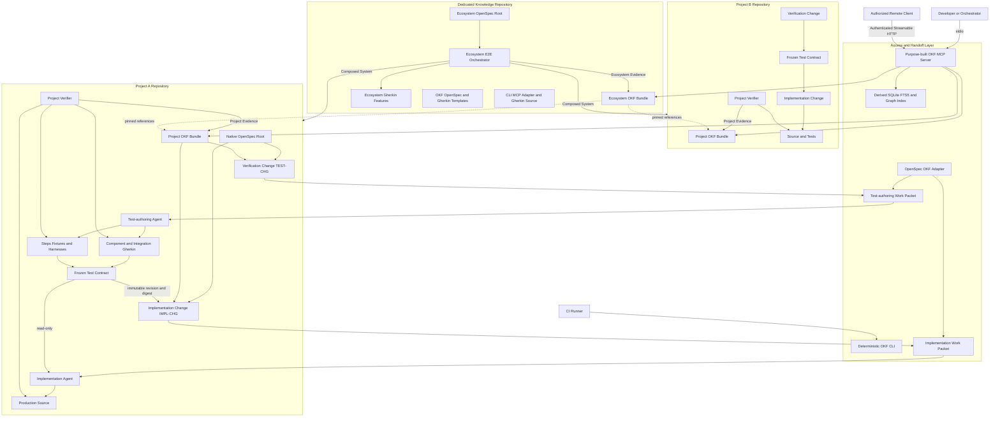

# Project Proposal: Federated OKF Knowledge and Verification

**Status:** Proposed  
**Scope:** Cross-project architecture  
**Canonical repository:** Dedicated knowledge repository (repository name and package layout are implementation details)

## 1. Executive Summary

This proposal defines a federated hybrid model for engineering knowledge and agentic change delivery using the Open Knowledge Format (OKF), Objectives and Key Results (OKRs), OpenSpec change artifacts, and executable Gherkin scenarios.

Each software project owns a project-local OKF bundle containing its objectives, key results, semantic requirement identities, architecture, decisions, risks, test definitions, test data references, test evidence, and operational knowledge. Each project also owns a native OpenSpec root containing current behavioral specifications and paired changes: a verification change for component and integration Gherkin plus their harnesses, and a linked implementation change for production code. A dedicated knowledge repository owns the ecosystem OKF bundle, reusable project and OpenSpec templates, engineering profile, deterministic CLI, purpose-built MCP server, shared Gherkin adapters, cross-project contracts, and ecosystem end-to-end verification. Knowledge and change artifacts remain versioned with their owning source rather than copied into a central database.

OKF wraps OpenSpec changes by reference instead of embedding or duplicating their files. Each delivery has an `OpenSpec Change` concept for its verification change and another for its implementation change. The implementation wrapper depends on the reviewed verification wrapper, immutable test revision, and Test Contract digest. A test-authoring agent receives the verification change first and creates all component and integration `.feature` files, step definitions, fixtures, and harnesses in a separate session without production-code write access. Only after deterministic readiness validation freezes those artifacts may a coding agent receive the implementation change, bounded OKF context, and the tests as read-only inputs.

A purpose-built OKF Model Context Protocol (MCP) server provides a consistent semantic interface over these bundles and produces Agent Work Packets. Local development clients can run the server over stdio against a workspace checkout. CI systems and authorized remote clients can use the same server over authenticated Streamable HTTP. The MCP server is a discovery, traversal, validation, context-assembly, and controlled-authoring facade; Git remains the canonical system of record.

Gherkin supplies the executable behavioral contract for both component and integration verification. OpenSpec scenarios are reviewable acceptance examples used to shape a change; they do not become evidence unless mapped to executable Gherkin. Component and integration tests are authored before production implementation in an independently reviewed verification change. Their readiness receipt proves that features parse, steps are complete, harnesses and fixtures are healthy, and expected-red failures represent missing behavior rather than broken test infrastructure. Product evidence is produced only when the frozen contract later executes against the implementation. Intent, implementation, and evidence roll upward through explicit links:

```text
Objective → Key Result → Requirement → Implementation Change → Coding Agent
                              │                ▲
                              └→ Verification Change
                                      │
                                      ├→ Frozen Gherkin + Harness Contract
                                      └→ Test Readiness Receipt
                                                    │
Implementation Receipt ← executable verification ──┘
```

The design preserves independent project ownership and does not create shared mutable agent memory. It separates verification authorship from implementation, federates curated knowledge by reference, and hands off bounded, digest-bound change packages in an enforced order.

## 2. Purpose

The proposal addresses six recurring problems in agentic software development:

1. **Project context is fragmented.** Requirements, architectural decisions, tests, runbooks, and historical evidence frequently live in unrelated systems.
2. **Agents lack traceability.** An agent may know what to change without knowing which objective it supports, which decision constrains it, or which tests prove completion.
3. **Change handoff is underspecified.** Agents need concrete, reviewable changes, repository scope, and verification contracts rather than an unbounded knowledge dump or chat transcript.
4. **Tests are coupled to implementation.** When one agent writes production code and its tests in one session, tests can mirror implementation mistakes or be weakened to obtain a passing result.
5. **Project tests and ecosystem tests are conflated.** A component or integration test owned by one repository remains Project Verification even when it uses real infrastructure; it does not prove independently deployed projects work together.
6. **Knowledge access is inconsistent.** Local agents, CI jobs, and remote MCP clients need the same semantics without depending on one proprietary wiki or runtime.

The proposed system makes engineering intent, change plans, constraints, execution contracts, and evidence portable and queryable while preserving Git-based review.

## 3. Goals and Non-Goals

### 3.1 Goals

- Define a reusable OKF software-development bundle template for new projects.
- Define a reusable OpenSpec profile for current behavioral specifications and reviewable change artifacts.
- Keep project-specific knowledge and change plans in the repository that owns them.
- Maintain a separate ecosystem bundle for shared and cross-project knowledge.
- Link objectives and measurable key results to requirements, paired verification and implementation changes, decisions, Gherkin scenarios, and evidence.
- Require every implementation change to depend on an independently reviewed verification change at an immutable revision and Test Contract digest.
- Author all project component and integration tests as executable Gherkin, with complete step definitions, fixtures, and harnesses, in a separate session before production implementation begins.
- Wrap native OpenSpec artifacts in OKF concepts without copying their content.
- Generate distinct, deterministic Agent Work Packets for test authors and coding agents with non-overlapping write scopes.
- Keep approved tests read-only during implementation and require a separate test-amendment change for semantic corrections.
- Distinguish Test Readiness from product evidence, OpenSpec acceptance examples from executable Gherkin, Project Verification from Ecosystem End-to-End Verification, and component scope from integration scope.
- Provide deterministic validation suitable for local hooks and CI.
- Provide a purpose-built MCP interface for discovery, graph traversal, context assembly, OpenSpec handoff, validation, and controlled draft creation.
- Support offline local use, ordinary Git workflows, CI runners, and authorized remote clients.
- Preserve provenance, trust, freshness, and lifecycle metadata from OKF.
- Support ARM64 and low-resource deployment environments.

### 3.2 Non-Goals

- Replace source code, test frameworks, OpenAPI, JSON Schema, Gherkin, OpenSpec native artifacts, or other domain-specific formats.
- Make OpenSpec task completion, Test Readiness, an expected-red result, an agent report, an MCP server, or a database the canonical source of product verification truth.
- Allow an implementation agent to modify an approved Test Contract directly or treat tests created after implementation as equivalent to the required independent verification change.
- Merge intentionally failing verification changes into the protected default branch; test and implementation branches merge together only after product verification passes.
- Reimplement the OpenSpec artifact lifecycle inside OKF or embed native OpenSpec files in OKF documents.
- Centralize private runtime memory from autonomous agents.
- Treat passing tests as proof that every business objective has been achieved.
- Store large or sensitive test datasets directly in Git.
- Let agents silently convert draft knowledge into human-reviewed knowledge.
- Store implementation tasks, scheduling, or milestone status as stable OKF knowledge; OpenSpec owns change-local tasks.

## 4. Terminology

| Term | Definition |
|---|---|
| **OKF** | Open Knowledge Format: linked Markdown concept documents with YAML frontmatter. This proposal targets OKF v0.2. |
| **OKR** | Objectives and Key Results: a framework expressing desired outcomes and measurable success conditions. |
| **OpenSpec** | Git-tracked spec-driven development artifacts containing current behavioral specifications and reviewable change proposals, deltas, designs, and tasks. |
| **OpenSpec Change** | One native OpenSpec change directory containing the artifacts required to understand and deliver a proposed modification. |
| **Verification Change** | An OpenSpec change, identified by `TEST-CHG-*`, that owns component and integration Gherkin, step definitions, fixtures, harnesses, readiness checks, and the Test Contract for a linked implementation change. |
| **Implementation Change** | An OpenSpec change, identified by `IMPL-CHG-*`, that owns the normative behavioral delta, technical design, production implementation tasks, and an immutable dependency on an approved Verification Change. |
| **Test Amendment Change** | A separately reviewed OpenSpec verification change that corrects an approved Test Contract and produces a replacement revision and digest. |
| **OpenSpec Change Wrapper** | An OKF concept that identifies and links an OpenSpec change by repository-relative resource, base revision, artifact digest, role, and dependency without copying its contents. |
| **Test Contract** | A manifest binding the component and integration Gherkin, steps, fixtures, harnesses, environment assumptions, readiness state, immutable revision, and aggregate digest. |
| **Test Readiness Receipt** | A non-product receipt proving that Gherkin parses, steps are complete, harnesses and fixtures operate, and expected-red results fail for the intended missing behavior rather than infrastructure defects. |
| **Acceptance Example** | A structured scenario in an OpenSpec behavioral specification. It guides review and test design but is not executable evidence by itself. |
| **Agent Work Packet** | A deterministic, role-specific handoff manifest for either test authorship or implementation, containing linked changes, bounded OKF context, repository and base revision, declared capabilities, read/write roots, verification targets, and content digests. |
| **Concept** | One OKF Markdown document representing a unit of knowledge. |
| **Project Bundle** | The OKF bundle owned by one software project and versioned with that project's code. |
| **Ecosystem Bundle** | The OKF bundle containing cross-project objectives, contracts, standards, and end-to-end verification knowledge. |
| **Federation** | Resolution and traversal of links across independently owned bundles without copying them into one authoritative store. |
| **Engineering Profile** | The additional concept types, metadata, relationship conventions, OpenSpec integration rules, and validation policy defined by this proposal on top of baseline OKF. |
| **Project Verification** | Verification owned and runnable by one repository, normally without requiring the complete deployed ecosystem. |
| **Ecosystem End-to-End Verification** | Verification of a composed system across real project boundaries and deployment contracts. |
| **Gherkin Feature** | An executable `.feature` artifact using Feature, Scenario, Given, When, and Then. |
| **Test Evidence** | An immutable or append-only record describing a specific verification run and its artifacts. |
| **Verification Receipt** | Structured output from a test run containing the commit, environment, scenarios, results, timing, and artifact references. |
| **Attester** | Deterministic code that checks whether a receipt satisfies a declared verification contract. |
| **Context Pack** | A bounded set of linked concepts assembled for an agent task. |

## 5. Architectural Principles

1. **Ownership follows responsibility.** A project owns knowledge about its behavior and implementation. The ecosystem owns knowledge about cross-project outcomes and contracts.
2. **Git is canonical.** OKF concepts, native OpenSpec artifacts, executable specifications, and code are Git-tracked; search indexes, vector stores, MCP caches, and generated work packets are derived and rebuildable.
3. **One canonical owner per concern.** OpenSpec owns change plans and current behavioral specification text; OKF owns semantic identity, OKRs, federation, provenance, trust, lifecycle, and evidence relationships; Gherkin owns executable behavioral contracts.
4. **Wrap and federate by reference.** OKF links to native OpenSpec and Gherkin resources at explicit revisions or digests instead of copying their contents.
5. **Progressive disclosure.** Clients discover bundles and concept summaries before loading full documents, OpenSpec changes, or related graphs.
6. **Independent verification precedes implementation.** A separate verification change and test-authoring session complete all component and integration Gherkin and harnesses before an implementation packet can be issued.
7. **Bounded, role-specific handoff.** Test authors receive no production-code write access; implementation agents receive the approved Test Contract read-only plus the smallest sufficient OKF context and production write scope.
8. **Immutable test dependency.** An implementation change binds to the reviewed verification revision and Test Contract digest. Any test modification requires a separate amendment, new review, and packet regeneration.
9. **Evidence before completion.** Checked OpenSpec tasks, Test Readiness, expected-red scenarios, an OpenSpec advisory verification, or an agent completion report do not constitute verified product evidence.
10. **Gherkin expresses executable behavior, not implementation.** Every project component and integration test is Gherkin-based; step definitions, fixtures, and harnesses remain in the verification change and owning codebase.
11. **Trust is visible.** Agent-generated, machine-confirmed, and human-reviewed knowledge remain distinguishable.
12. **Stable knowledge changes through review.** Agents may create drafts and proposals; humans or authorized processes promote them.
13. **Project tests are not mislabeled as ecosystem E2E.** Component and integration tests owned by one repository remain Project Verification even when they use real infrastructure.
14. **Untrusted content cannot grant capabilities.** OKF, OpenSpec, Gherkin, test output, and external sources are data inputs; only the authenticated invocation and repository policy define agent tools and permissions.

## 6. Proposed Federated Architecture



### 6.1 Responsibilities

| Component | Responsibility | Canonical data |
|---|---|---|
| Project repository | Project behavior, OpenSpec changes, semantic knowledge, code, executable tests, and project evidence | Native OpenSpec artifacts, project OKF bundle, source, and executable tests |
| Native OpenSpec root | Hold current behavioral specifications, linked verification and implementation changes, designs, tasks, Test Contracts, and archive artifacts | Current behavioral specification text and paired change plans |
| Verification Change | Own component and integration Gherkin, steps, fixtures, harnesses, readiness tasks, and Test Contract | Reviewed test contract on its verification branch |
| Implementation Change | Own behavioral deltas, production design and tasks, and immutable dependency on the Verification Change | Reviewed implementation plan and proposed production changes |
| Test-authoring agent | Apply only the Verification Change in a separate session without production-code write access | Proposed Gherkin, steps, fixtures, harnesses, and readiness artifacts |
| Implementation agent | Apply only the Implementation Change after test freeze; consume tests read-only | Proposed production source and implementation-plan modifications |
| OpenSpec/OKF adapter | Generate and validate paired wrappers, dependencies, digests, requirement mappings, readiness receipts, and role-specific Agent Work Packets | None; generated manifests and diagnostics only |
| Dedicated knowledge repository | Ecosystem OKF bundle, ecosystem OpenSpec root, reusable project templates, engineering profile, CLI, MCP server, integration adapter, shared TypeScript/Go Gherkin adapters, cross-project contracts, and E2E orchestration | Ecosystem bundle, ecosystem plans, tooling source, shared adapters, and E2E features |
| OKF CLI | Deterministic scaffold, wrapping, validation, graph checks, work-packet generation, indexing, packaging, and reporting | None |
| OKF MCP server | Semantic discovery, retrieval, traversal, context assembly, Agent Work Packet generation, validation, and controlled proposals | None; derived cache only |
| Project verifier | Execute project-owned checks and emit receipts | CI artifacts; selected evidence concepts |
| Ecosystem E2E orchestrator | Compose real services, execute cross-project Gherkin, collect evidence, and clean up | CI artifacts; selected ecosystem evidence concepts |
| Search/index cache | Accelerate exact, full-text, tag, and relation search | Rebuildable SQLite FTS5 and relational-edge index initially; PostgreSQL after migration triggers are met |

### 6.2 Relationship to Component Memory

The OKF federation and OpenSpec change layer are not shared mutable memory services for agent transcripts, preferences, or private execution state. They contain curated knowledge and reviewable change artifacts intended for reuse. Test authors may revise only active Verification Changes before freeze; implementation agents may revise only active Implementation Changes within policy. Promotion into stable knowledge and joint archive of the paired delivery occur through explicit review.

### 6.3 Canonical Ownership Boundaries

Each concern has one canonical representation:

| Concern | Canonical representation |
|---|---|
| Objective, Key Result, risk, provenance, lifecycle, and trust | OKF concept |
| Stable semantic identity of a requirement | OKF Requirement concept |
| Normative current behavioral requirement text | Native `openspec/specs/` requirement |
| Proposed behavioral modification and production design | Native Implementation Change |
| Component and integration executable behavior | Gherkin `.feature` files owned by the Verification Change |
| Component and integration steps, fixtures, and harnesses | Test assets owned by the Verification Change |
| Approved pre-implementation test baseline | Immutable Test Contract manifest, verification revision, and Test Readiness Receipt |
| Production implementation tasks | Native Implementation Change `tasks.md` |
| Durable accepted architecture decision | OKF Architecture Decision concept |
| Product verification result | Common verification receipt and signed attestation |
| Selected release-significant evidence | OKF Test Evidence concept |

An OKF Requirement concept is a semantic envelope around its OpenSpec requirement resource. It carries the stable ID and graph relationships but does not repeat the normative requirement body. Every delivery has two OpenSpec Change Wrappers: the Verification Change Wrapper points to the native test-planning change and resulting Test Contract, while the Implementation Change Wrapper declares an immutable dependency on the approved verification revision and digest. Neither wrapper embeds native OpenSpec or Gherkin contents.

### 6.4 OpenSpec Stores and OKF Federation

A dedicated repository may contain an ordinary OpenSpec root for ecosystem planning. OpenSpec Stores, references, or worksets may be used experimentally for planning ergonomics, but they do not replace OKF federation. Reproducible resolution, canonical `okf://` identity, pinned dependencies, trust evaluation, and evidence continue to use the OKF federation contract. CI must not depend on a mutable or stale local OpenSpec store checkout without resolving and recording its immutable Git revision and artifact digest.

## 7. Project Bundle Template

Each participating repository contains a project-local bundle and engineering-profile configuration:

```text
project/
├── openspec/
│   ├── config.yaml
│   ├── schemas/
│   │   ├── okf-verification-change/
│   │   └── okf-implementation-change/
│   ├── specs/
│   └── changes/
│       └── archive/
├── knowledge/
│   ├── index.md
│   ├── log.md
│   ├── project.md
│   ├── objectives/
│   ├── requirements/
│   ├── changes/
│   ├── architecture/
│   │   ├── components/
│   │   ├── interfaces/
│   │   └── diagrams/
│   ├── decisions/
│   ├── testing/
│   │   ├── procedures/
│   │   ├── datasets/
│   │   ├── computations/
│   │   └── evidence/
│   ├── operations/
│   │   ├── runbooks/
│   │   └── incidents/
│   ├── risks/
│   └── references/
├── tests/
│   ├── component/
│   │   ├── features/
│   │   ├── steps/
│   │   ├── fixtures/
│   │   └── support/
│   └── integration/
│       ├── features/
│       ├── steps/
│       ├── fixtures/
│       └── support/
└── .okf/
    ├── bundle.yaml
    ├── profile.yaml
    ├── policy.yaml
    ├── templates/
    └── attesters/
```

Native OpenSpec files and actual `.feature` files remain domain-specific artifacts. OKF Requirement and OpenSpec Change concepts reference OpenSpec resources through `resource`; OKF Test Procedure or Gherkin Feature concepts reference executable features the same way. This follows OKF's role as a semantic envelope that references rather than replaces native formats. Generated Agent Work Packets are build artifacts and are not committed by default.

### 7.1 Engineering Concept Types

The engineering profile defines the following conventional values for `type`:

- `Software Project`
- `Objective`
- `Key Result`
- `Requirement`
- `OpenSpec Change`
- `Architecture Component`
- `Interface Contract`
- `Architecture Decision`
- `Risk`
- `Gherkin Feature`
- `Test Contract`
- `Test Readiness Evidence`
- `Test Procedure`
- `Test Dataset`
- `Test Evidence`
- `Runbook`
- `Incident Lesson`
- `Attested Computation`
- `Reference`

Unknown types remain readable under baseline OKF rules, but strict engineering-profile validation may warn or fail according to repository policy.

### 7.2 Bundle Identity

`.okf/bundle.yaml` is an engineering-profile file outside the OKF concept tree:

```yaml
profile: okf-software-engineering/v1
bundle:
  id: com.example.project-a
  title: Project A
  kind: project
  repository: https://example.com/project-a.git
  default_branch: main
federation:
  dependencies:
    - id: com.example.engineering
      repository: https://example.com/engineering-knowledge.git
      revision: abc123
      path: knowledge
```

A bundle dependency must pin a Git revision, release, or immutable artifact digest for reproducible CI and evidence generation. Interactive local clients may opt into a moving development revision but must expose that choice to the user.

### 7.3 OpenSpec Profile and Artifact Layout

The project uses two linked native OpenSpec change profiles rather than mixing test authorship and implementation in one change:

```text
openspec/
├── config.yaml
├── schemas/
│   ├── okf-verification-change/
│   │   ├── schema.yaml
│   │   └── templates/
│   └── okf-implementation-change/
│       ├── schema.yaml
│       └── templates/
├── specs/
│   └── storage/
│       └── spec.md
└── changes/
    ├── verify-persistent-storage/
    │   ├── .openspec.yaml
    │   ├── proposal.md
    │   ├── verification-plan.md
    │   ├── tasks.md
    │   └── test-contract.yaml
    └── implement-persistent-storage/
        ├── .openspec.yaml
        ├── proposal.md
        ├── specs/
        │   └── storage/
        │       └── spec.md
        ├── design.md
        ├── verification-dependency.yaml
        └── tasks.md
```

The initial profiles are `okf-verification-change/v1` and `okf-implementation-change/v1`. The Implementation Change may be proposed first so its reviewed intent and behavioral delta can drive test design, but its implementation tasks remain blocked until the linked Verification Change has an approved immutable Test Contract.

Verification Change artifacts have these responsibilities:

| Artifact | Required content |
|---|---|
| `proposal.md` | `TEST-CHG-*` ID, linked `IMPL-CHG-*` ID, requirements, test scope, boundaries, independence policy, and expected deliverables |
| `verification-plan.md` | Component and integration scenarios, harness architecture, interfaces, fixtures, environments, cleanup, negative controls, expected-red classifications, and readiness criteria |
| `tasks.md` | Gherkin, step, fixture, harness, self-test, negative-control, and readiness work only; no production implementation tasks |
| `test-contract.yaml` | Immutable manifest of features, steps, fixtures, harnesses, environment assumptions, readiness receipt, test revision, and aggregate digest |
| `.openspec.yaml` | Pinned verification-change schema and supported native OpenSpec metadata |

Implementation Change artifacts have these responsibilities:

| Artifact | Required content |
|---|---|
| `proposal.md` | `IMPL-CHG-*` ID, intent, scope, non-goals, owning bundle, Objective and Key Result references, risks, and linked `TEST-CHG-*` ID |
| Delta `specs/**/*.md` | `ADDED`, `MODIFIED`, and `REMOVED` behavioral requirements using stable OKF requirement IDs and concrete acceptance examples |
| `design.md` | Production technical approach, constraints, alternatives, migration and rollback, security boundaries, affected interfaces, and decision links |
| `verification-dependency.yaml` | Approved Verification Change reference, immutable test revision, Test Contract digest, readiness receipt digest, and required component/integration tags |
| `tasks.md` | Production implementation and operational work plus deterministic execution of the frozen tests; it cannot authorize edits to test assets |
| `.openspec.yaml` | Pinned implementation-change schema and supported native OpenSpec metadata |

Project `openspec/config.yaml` injects repository conventions and artifact-specific rules. The OpenSpec package version and generated agent integration files are pinned and updated through reviewed dependency changes. OpenSpec artifact dependencies describe ordering, but the orchestrator and CI enforce the cross-change readiness and authorization gate.

### 7.4 Writing Behavioral Specifications

Current externally observable behavior is written once in `openspec/specs/`. Each requirement heading begins with its stable OKF ID:

```markdown
# Storage Specification

## Purpose

Behavior of persistent application storage across compute replacement.

## Requirements

### Requirement: REQ-014 — Persistent application data

The service SHALL keep application data independent of the compute instance lifecycle.

#### Scenario: Recreate using an existing volume

- **GIVEN** a service has written a uniquely identified record
- **WHEN** its compute instance is replaced and the existing volume is attached
- **THEN** the recreated service becomes healthy
- **AND** the record remains readable
```

A change modifies this behavior through a native delta specification:

```markdown
# Delta for Storage

## MODIFIED Requirements

### Requirement: REQ-014 — Persistent application data

The service SHALL keep application data independent of the compute instance lifecycle and SHALL refuse startup when the expected persistent volume is absent.

#### Scenario: Expected volume is absent

- **GIVEN** the service is configured to require persistent storage
- **WHEN** it starts without the expected volume
- **THEN** startup fails with an actionable diagnostic
```

The rules are:

1. The stable ID is part of the requirement heading and does not change when the title or wording changes.
2. The OpenSpec current spec is the canonical normative behavior text; the OKF Requirement concept supplies semantic identity and relationships.
3. OpenSpec acceptance examples remain concise and observable. They seed, but do not replace, the independently authored executable component and integration Gherkin.
4. Every changed requirement maps to at least one executable Gherkin scenario in the Verification Change. Release-critical behavior has both the component or integration coverage required by its verification plan.
5. The test-authoring agent may read the reviewed implementation proposal, delta specs, design constraints, interfaces, and OKF context but may not modify production code.
6. `REMOVED` requirements cause a proposed OKF lifecycle transition to `deprecated` with a replacement or rationale; they do not silently delete semantic history.
7. Implementation details belong in the Implementation Change `design.md` and `tasks.md`; test mechanics belong in the Verification Change and test harness.

An OKF Requirement envelope therefore references, rather than copies, the native requirement:

```yaml
---
type: Requirement
id: REQ-014
title: Persistent application data
status: stable
resource: ../../openspec/specs/storage/spec.md#requirement-req-014--persistent-application-data
generated: { by: human:owner, at: 2026-09-15T12:00:00Z }
verified: { by: human:owner, at: 2026-09-15T12:00:00Z }
---
```

Its body links the Objective, Key Result, risks, decisions, executable Gherkin, and evidence. It does not restate the requirement body.

### 7.5 Paired OpenSpec Change Wrappers and Test Contract

Every Verification Change and Implementation Change has its own OKF wrapper in `knowledge/changes/`. The two wrappers make their dependency explicit.

Verification wrapper:

```yaml
---
type: OpenSpec Change
id: TEST-CHG-042
title: Verify persistent application storage
description: Define component and integration behavior before implementation.
status: draft
change_role: verification
resource: ../../openspec/changes/verify-persistent-storage/
base_revision: abc123
artifact_digest: sha256:verify0123456789
owning_bundle: com.example.project-a
verifies_change: IMPL-CHG-043
verification_scope: project
generated: { by: process:openspec-okf-adapter, at: 2026-09-16T12:00:00Z }
---
```

Implementation wrapper after test freeze:

```yaml
---
type: OpenSpec Change
id: IMPL-CHG-043
title: Implement persistent application storage
description: Make application data independent of compute replacement.
status: draft
change_role: implementation
resource: ../../openspec/changes/implement-persistent-storage/
base_revision: abc123
artifact_digest: sha256:implement0123456789
owning_bundle: com.example.project-a
depends_on:
  - change: TEST-CHG-042
    revision: test789
    test_contract_digest: sha256:testcontract012345
    readiness_receipt_digest: sha256:readiness012345
verification_scope: project
generated: { by: process:openspec-okf-adapter, at: 2026-09-16T14:00:00Z }
---
```

The wrapper body contains links under these conventional headings:

- `## Supports` for Objectives and Key Results;
- `## Changes` for requirements, interfaces, and components;
- `## Paired Change` for the verification or implementation counterpart;
- `## Constrained By` for decisions, standards, and risks;
- `## Verification` for executable features, Test Contract, scope, and evidence policy;
- `## Participants` for every repository and bundle in a cross-project change.

The approved Test Contract is a native artifact in the Verification Change:

```yaml
version: 1.0
verification_change: TEST-CHG-042
implementation_change: IMPL-CHG-043
base_revision: abc123
test_revision: test789
requirements: [REQ-014]
features:
  - path: tests/component/features/persistent-storage.feature
    sha256: component111
    baseline_expectation: failing
  - path: tests/integration/features/persistent-storage-lifecycle.feature
    sha256: integration222
    baseline_expectation: failing
steps:
  - path: tests/component/steps/
    sha256: steps111
  - path: tests/integration/steps/
    sha256: steps222
harnesses:
  - path: tests/component/support/
    sha256: harness333
  - path: tests/integration/support/
    sha256: harness444
fixtures:
  - path: tests/integration/fixtures/
    sha256: fixtures555
environments:
  - id: project-integration-arm64
    configuration_digest: sha256:environment666
policy_digest: sha256:readinesspolicy777
readiness_receipt:
  resource: artifact://run-123/test-readiness.json
  sha256: readiness012345
contract_digest: sha256:testcontract012345
review:
  status: approved
```

The adapter calculates each change `artifact_digest` and the aggregate Test Contract digest from sorted manifests of repository-relative paths and SHA-256 digests of exact file bytes. Directory metadata and generated transient files are excluded. Any mismatch invalidates dependent packets. After readiness approval, changes to a feature, step, fixture, harness, environment assumption, or expected baseline require a Test Amendment Change and a replacement contract digest.

### 7.6 Paired Change Lifecycle and Session Handoff

The approved lifecycle is:

1. **Explore.** A human or planning agent investigates without creating canonical artifacts.
2. **Plan implementation intent.** Create `IMPL-CHG-*` with proposal, behavioral delta, and design sufficient to define observable behavior and test boundaries. Production tasks are not actionable and no implementation packet may be issued.
3. **Review intent.** Humans approve requirements, acceptance examples, interfaces, risks, and verification scope. The adapter wraps and digests the planned Implementation Change.
4. **Create the Verification Change.** Create linked `TEST-CHG-*` from the reviewed implementation intent. Its scope is exclusively component and integration Gherkin, steps, fixtures, harnesses, and readiness.
5. **Issue a test-authoring packet.** The orchestrator starts a clean session with test and verification-change write access and production roots read-only.
6. **Author verification.** The test agent creates all required `.feature` files, step definitions, deterministic fixtures, harnesses, environment setup, cleanup, diagnostics, self-tests, and negative controls.
7. **Run the readiness gate.** Deterministic CI confirms that Gherkin parses, requirement links resolve, no steps are undefined or ambiguous, harnesses reach intended boundaries, fixtures and cleanup work, existing behavior passes, and new behavior either fails for the expected reason or has an explicitly reviewed already-existing classification. Infrastructure or harness failures are not acceptable expected-red outcomes.
8. **Freeze the Test Contract.** Human review approves the verification branch revision and Test Contract digest. A Test Readiness Receipt records readiness but is not product evidence. The Verification Change remains immutable by policy until final merge.
9. **Bind implementation.** Add `verification-dependency.yaml` and the frozen references to the Implementation Change, generate production tasks, and create an implementation branch based exactly on the approved verification revision.
10. **Issue an implementation packet.** The orchestrator starts a new session. Production roots are writable; verification features, steps, fixtures, harnesses, and Test Contract are read-only.
11. **Implement.** The coding agent performs only the Implementation Change and runs the frozen component and integration suites. It may not weaken or rewrite tests to obtain a passing result.
12. **Amend tests when necessary.** If a test defect is discovered, implementation pauses. A separate `TEST-AMEND-*` change, session, review, readiness run, revision, and contract digest are required before regenerating the implementation packet.
13. **Verify and merge.** Deterministic project verification emits the product receipt. The verification branch and implementation branch are stacked and merge together only when the frozen suites pass; intentionally red tests never land alone on the protected default branch.
14. **Archive and promote.** Archive both linked changes together, update both wrappers to final resources and digests, merge accepted behavioral deltas into current specs, and propose durable decisions, lifecycle updates, and selected evidence through OKF review.

The branch topology is:

```text
main@abc123
    └── verify/TEST-CHG-042@test789
          ├── Gherkin, steps, fixtures, harnesses, Test Contract
          └── implement/IMPL-CHG-043@impl456
                └── production implementation
```

The implementation branch is based on the approved verification commit. The pair may be reviewed as stacked pull requests or one combined delivery, but branch protection must preserve the recorded test revision and digest. Rebasing or modifying the verification layer invalidates approval and requires a new readiness receipt.

The two handoffs are intentionally different:

```text
Test-authoring session
  Verification Change + reviewed intent + OKF context
  writable: tests/** and verification-change artifacts
  read-only: production source and implementation artifacts

Implementation session
  Implementation Change + frozen Test Contract + OKF context
  writable: production source and implementation-change artifacts
  read-only: tests/** and verification-change artifacts
```

OpenSpec files remain in native paths because OpenSpec-aware agents and commands rely on that layout. Work packets reference paths and digests rather than flattening files into one prompt.

## 8. Ecosystem Bundle Template

The ecosystem bundle contains only knowledge whose ownership is genuinely cross-project:

```text
dedicated-knowledge-repository/
├── openspec/
│   ├── config.yaml
│   ├── specs/
│   └── changes/
├── knowledge/
│   ├── index.md
│   ├── log.md
│   ├── ecosystem.md
│   ├── objectives/
│   ├── capabilities/
│   ├── contracts/
│   ├── changes/
│   ├── architecture/
│   ├── decisions/
│   ├── standards/
│   ├── testing/
│   │   ├── features/
│   │   ├── procedures/
│   │   ├── environments/
│   │   └── evidence/
│   ├── operations/
│   ├── risks/
│   └── references/
├── tests/
│   └── end-to-end/
│       ├── features/
│       ├── steps/
│       ├── fixtures/
│       └── support/
└── .okf/
    ├── bundle.yaml
    ├── profile.yaml
    ├── policy.yaml
    └── attesters/
```

The ecosystem OpenSpec root owns plans and executable E2E contracts whose responsibility is genuinely cross-project. Its change wrappers list all participant bundles and repositories. Each writable project receives its own linked Verification Change and Implementation Change; project component/integration Gherkin is completed and frozen locally before implementation, while ecosystem Gherkin remains owned by the dedicated repository. The ecosystem bundle references pinned project requirements, paired changes, Test Contracts, and interface concepts without duplicating their contents or routing one task list across repositories.

## 9. Federation Contract

### 9.1 Discovery

A consumer discovers bundles from one or more of:

- explicit local paths;
- workspace configuration;
- `.okf/bundle.yaml` dependencies;
- Git URLs pinned to revisions;
- immutable bundle archives and checksums;
- an administrator-configured remote catalog.

Discovery never grants write access by itself.

### 9.2 Canonical Identity and References

Every engineering-profile concept must declare a stable `id` in frontmatter. IDs are unique within a bundle, while the bundle ID supplies the global namespace:

```yaml
---
type: Requirement
id: REQ-014
title: Persistent application data
---
```

The canonical immutable concept reference is:

```text
okf://<bundle-id>/<percent-encoded-concept-id>?revision=<immutable-revision>
```

Example:

```text
okf://com.example.project-a/REQ-014?revision=abc123
```

An artifact digest may replace a Git revision by using `digest=sha256:<value>`. A reference must not contain both. The engineering profile normalizes this tuple as `(bundleId, conceptId, revision|digest)` for graph keys, cache keys, receipts, and MCP resources.

Reference rules are:

- Within one bundle, ordinary relative or bundle-root Markdown links remain the preferred human-readable form; the resolver binds them to the current bundle ID and authored revision.
- Cross-bundle Markdown links use the canonical `okf://` URI.
- OKF Requirement and OpenSpec Change concepts use repository-relative `resource` values for native OpenSpec artifacts in the same repository. Persisted graph edges normalize the owning bundle, repository revision, resource path or heading, and content digest.
- An active wrapper records the change role, base Git revision, and artifact digest. An Implementation Change additionally records the immutable Verification Change revision, Test Contract digest, and readiness receipt digest. Archived wrappers record final revisions and digests. Active resources are never used as release evidence without this binding.
- A Test Contract reference is the tuple `(bundleId, verificationChangeId, testRevision, contractDigest)`. Changing any element invalidates dependent implementation packets and receipts.
- Gherkin uses readable qualified tags such as `@requirement_com.example.project-a__REQ-014`. The verifier resolves each qualified tag through the run's bundle lock and records the canonical immutable URI in the receipt.
- Local shorthand such as `@requirement_REQ-014` is allowed only for project-scoped features whose owning bundle is unambiguous. It is expanded before evidence is emitted.
- Receipts, Agent Work Packets, ecosystem manifests, remote MCP responses, and persisted graph edges always use canonical immutable concept references rather than shorthand.

Objective and Key Result examples in this proposal therefore require IDs even when a local filename is descriptive.

### 9.3 Resolution

A federated concept reference includes:

- bundle ID;
- stable concept ID;
- immutable revision or digest for reproducible use;
- optional expected concept type;
- optional compatibility range for interactive use.

Resolution order is explicit:

1. task-specific workspace overlay;
2. current project bundle;
3. pinned ecosystem dependencies;
4. configured read-only external references.

A conflict must produce diagnostics naming both sources. The server must not silently choose between two stable concepts claiming the same identity.

### 9.4 Offline and Failure Behavior

- Local project concepts remain available without network access.
- Previously fetched pinned dependencies may be served from a content-addressed cache.
- A missing required dependency fails validation and context assembly.
- A missing optional dependency produces a warning and a partial result marker.
- Mutable remote references are not accepted for CI evidence unless resolved and recorded as an immutable revision.

### 9.5 Freshness and Trust

Consumers surface OKF lifecycle and trust signals:

- `draft`, `stable`, and `deprecated` status;
- `stale_after` evaluation;
- generator identity and timestamp;
- machine or human verification;
- source provenance.

Context assembly prefers current human-reviewed concepts, then current machine-confirmed concepts, then unverified concepts. Lower-trust material may still be returned but must be labeled.

## 10. OKRs in the Engineering Profile

### 10.1 Objectives

An Objective concept expresses a qualitative desired outcome. It links to one or more Key Result concepts.

```yaml
---
type: Objective
id: O-001
title: Reliable project delivery
description: Changes reach production with predictable quality and low operator effort.
status: stable
tags: [delivery, reliability]
generated: { by: human:owner, at: 2026-09-15T12:00:00Z }
verified: { by: human:owner, at: 2026-09-15T12:00:00Z }
---
```

### 10.2 Key Results

A Key Result concept declares a measurable outcome and how evidence is evaluated. Engineering-profile extensions are permitted by OKF:

```yaml
---
type: Key Result
id: KR-001
title: All release-critical acceptance scenarios pass
description: Release-critical project behavior remains verified on the release commit.
status: stable
measurement:
  kind: gherkin_rollup
  operator: equals
  target: 100
  unit: percent
verification_policy:
  required_tags: [release-critical]
  minimum_trust: machine-confirmed
  maximum_evidence_age: P7D
generated: { by: human:owner, at: 2026-09-15T12:00:00Z }
verified: { by: human:owner, at: 2026-09-15T12:00:00Z }
---
```

Supported measurement kinds should include:

| Kind | Example |
|---|---|
| `gherkin_rollup` | 100% of release-critical scenarios pass |
| `metric_threshold` | p95 response time is below 500 ms |
| `count_threshold` | Zero unresolved critical vulnerabilities |
| `attested_computation` | Recovery duration computed from sanctioned event timestamps |
| `manual_assessment` | Human-reviewed usability or strategic outcome |
| `composite` | Weighted or all-of combination of other key results |

Passing Gherkin scenarios can support a Key Result, but the system must not imply that behavioral tests prove an external business outcome unless the measurement contract explicitly says so.

### 10.3 Traceability

Relationships are represented with ordinary Markdown links in concept bodies. Stable extension fields may be used to accelerate deterministic validation, but links remain the portable representation.

The expected chain is:

```text
Objective
  └── Key Result
       ├── Requirement
       │    ├── Implementation Change
       │    │    ├── Proposal, Behavioral Delta, Design, and Tasks
       │    │    ├── depends on Verification Change
       │    │    └── Implementation Work Packet
       │    ├── Verification Change
       │    │    ├── Component and Integration Gherkin
       │    │    ├── Steps, Fixtures, and Harnesses
       │    │    ├── Test Contract and Readiness Receipt
       │    │    └── Test-authoring Work Packet
       │    ├── Architecture Decision
       │    └── Product Verification Receipt
       ├── Metric or Attested Computation
       └── Test Evidence
```

A paired change may support several requirements and Key Results, but both wrappers and their dependency edge must be explicit. Verification tasks and readiness never participate directly in Objective or Key Result evaluation; only declared measurements and product evidence do.

## 11. Gherkin Verification Framework

### 11.1 Role of Gherkin

Gherkin is the canonical executable behavioral specification language for every project component test, project integration test, and ecosystem end-to-end scenario in this proposal. It expresses observable behavior and does not prescribe production implementation details. OpenSpec behavioral specifications also contain Given/When/Then-style acceptance examples, but those examples seed an independently authored Verification Change and are not executable evidence.

Every executable component or integration Feature is represented by:

1. a `.feature` file created by the test-authoring session;
2. an OKF `Gherkin Feature` or `Test Procedure` concept that describes ownership, provenance, trust, lifecycle, and relationships;
3. one or more mapped OpenSpec requirement IDs and paired change IDs;
4. complete step definitions, deterministic fixtures, and a harness owned by the Verification Change;
5. a Test Contract entry with path and digest;
6. a verifier capable of emitting the readiness receipt before implementation and the product receipt afterward.

### 11.2 Tagging Convention

Gherkin tags create deterministic join keys without embedding YAML in `.feature` files:

```gherkin
@objective_com.example.project-a__O-001
@kr_com.example.project-a__KR-001
@requirement_com.example.project-a__REQ-014
@verification_com.example.project-a__TEST-CHG-042
@implementation_com.example.project-a__IMPL-CHG-043
@integration
@project
@release-critical
Feature: Persistent application data
```

Conventional tags:

| Tag pattern | Meaning |
|---|---|
| `@objective_<bundle>__<id>` | Objective supported by the feature or scenario |
| `@kr_<bundle>__<id>` | Key Result receiving evidence |
| `@requirement_<bundle>__<id>` | Requirement verified |
| `@verification_<bundle>__<id>` | Verification Change that owns the scenario |
| `@implementation_<bundle>__<id>` | Implementation Change constrained by the scenario |
| `@risk_<bundle>__<id>` | Risk mitigated or exercised |
| `@component` | Exercises one project component through a controlled boundary |
| `@integration` | Exercises multiple real components or infrastructure dependencies owned by one project |
| `@project` | Project Verification scope |
| `@ecosystem` | Ecosystem E2E scope |
| `@contract` | Producer/consumer contract scenario |
| `@release-critical` | Required for release evidence |
| `@manual` | Requires a human step or assessment |
| `@destructive` | Requires an isolated environment and explicit authorization |

Scenario-level tags may narrow or extend feature-level relationships. `@component` and `@integration` are both Project Verification when one repository owns the harness and outcome. `@ecosystem` is reserved for scenarios crossing independently owned and deployed project boundaries.

#### 11.2.1 Test Readiness Gate

Before implementation begins, the Verification Change runs a deterministic readiness profile. The gate requires:

1. every feature parses and satisfies lint policy;
2. every scenario resolves its requirement, Verification Change, and Implementation Change IDs;
3. no step is undefined or ambiguous;
4. fixtures are deterministic, isolated, classified, and cleanable;
5. component and integration harnesses start and reach their declared system boundaries;
6. environment provisioning, diagnostics, teardown, and resource cleanup succeed;
7. existing behavior scenarios pass;
8. at least one scenario for each new or changed behavior fails for the expected missing-behavior reason, unless review records that the behavior already exists and the delivery is limited to non-behavioral implementation work;
9. negative controls demonstrate that each harness detects incorrect behavior;
10. syntax, credential, fixture, dependency, timeout, and infrastructure failures are classified as readiness failures rather than acceptable red tests;
11. the complete suite runs on required target architectures, including `linux/arm64`;
12. feature, step, fixture, harness, environment, and policy digests are recorded in the Test Contract.

The gate emits a Test Readiness Receipt with `ready`, `not_ready`, or `indeterminate` status. `ready` authorizes creation of the dependent implementation packet but does not support a Key Result, mark product behavior as passed, or become Test Evidence. Expected-red scenario details may be access-controlled so an implementation agent receives the contract and observable failures without private test-author reasoning.

### 11.3 Common Verification Receipt

Every project and ecosystem Gherkin runner emits the same envelope. Project receipts contain one participant; ecosystem receipts contain every composed participant and contract. The envelope binds the result to source, executable specification, harness, deployable artifacts, environment, and policy:

```json
{
  "receiptVersion": "1.0",
  "scope": "ecosystem",
  "run": {
    "id": "ecosystem-e2e-20260915-001",
    "startedAt": "2026-09-15T15:00:00Z",
    "completedAt": "2026-09-15T15:04:12Z",
    "producer": {
      "workflow": "https://example.com/ecosystem/actions/runs/123",
      "runnerIdentity": "https://token.actions.example/sub/repo:ecosystem:ref:main",
      "orchestratorRevision": "789abc"
    }
  },
  "participants": [
    {
      "bundleId": "com.example.project-a",
      "bundleRevision": "abc123",
      "sourceRevision": "def456",
      "deployable": "image@sha256:111..."
    },
    {
      "bundleId": "com.example.project-b",
      "bundleRevision": "456def",
      "sourceRevision": "789abc",
      "deployable": "image@sha256:222..."
    }
  ],
  "contracts": [
    {
      "id": "com.example.contract.task-api",
      "version": "2.1.0",
      "digest": "sha256:333..."
    }
  ],
  "specification": {
    "featuresRevision": "456def",
    "feature": "tests/end-to-end/features/verified-delivery.feature",
    "featureDigest": "sha256:444...",
    "stepHarnessRevision": "789abc",
    "stepHarnessDigest": "sha256:555..."
  },
  "environment": {
    "id": "staging-arm64",
    "configurationDigest": "sha256:666..."
  },
  "changes": [
    {
      "id": "TEST-CHG-042",
      "role": "verification",
      "bundleId": "com.example.project-a",
      "wrapperRef": "okf://com.example.project-a/TEST-CHG-042?revision=test789",
      "resource": "openspec/changes/archive/2026-09-16-verify-persistent-storage/",
      "baseRevision": "abc123",
      "artifactDigest": "sha256:verify0123456789..."
    },
    {
      "id": "IMPL-CHG-043",
      "role": "implementation",
      "bundleId": "com.example.project-a",
      "wrapperRef": "okf://com.example.project-a/IMPL-CHG-043?revision=impl456",
      "resource": "openspec/changes/archive/2026-09-16-implement-persistent-storage/",
      "baseRevision": "test789",
      "artifactDigest": "sha256:implement0123456789..."
    },
    {
      "id": "TEST-CHG-019",
      "role": "verification",
      "bundleId": "com.example.project-b",
      "wrapperRef": "okf://com.example.project-b/TEST-CHG-019?revision=test012",
      "resource": "openspec/changes/archive/2026-09-16-verify-storage-consumer/",
      "baseRevision": "456def",
      "artifactDigest": "sha256:verifyprojectb..."
    },
    {
      "id": "IMPL-CHG-020",
      "role": "implementation",
      "bundleId": "com.example.project-b",
      "wrapperRef": "okf://com.example.project-b/IMPL-CHG-020?revision=impl345",
      "resource": "openspec/changes/archive/2026-09-16-implement-storage-consumer/",
      "baseRevision": "test012",
      "artifactDigest": "sha256:implementprojectb..."
    }
  ],
  "testContracts": [
    {
      "bundleId": "com.example.project-a",
      "verificationChange": "TEST-CHG-042",
      "implementationChange": "IMPL-CHG-043",
      "testRevision": "test789",
      "digest": "sha256:testcontract012345...",
      "readinessReceiptDigest": "sha256:readiness012345..."
    },
    {
      "bundleId": "com.example.project-b",
      "verificationChange": "TEST-CHG-019",
      "implementationChange": "IMPL-CHG-020",
      "testRevision": "test012",
      "digest": "sha256:testcontractprojectb...",
      "readinessReceiptDigest": "sha256:readinessprojectb..."
    }
  ],
  "framework": "cucumber",
  "conceptRefs": [
    "okf://com.example.engineering/ECO-KR-002?revision=456def",
    "okf://com.example.project-a/REQ-014?revision=abc123"
  ],
  "features": [
    {
      "resource": "tests/end-to-end/features/verified-delivery.feature",
      "digest": "sha256:444...",
      "scenarios": [
        {
          "id": "verified-delivery;accepted-requirement",
          "status": "passed",
          "durationMs": 4281,
          "conceptRefs": [
            "okf://com.example.engineering/ECO-KR-002?revision=456def"
          ]
        }
      ]
    }
  ],
  "artifacts": [
    {
      "kind": "log",
      "resource": "artifact://run-123/acceptance.log",
      "sha256": "777..."
    }
  ],
  "policy": {
    "id": "okf-verification-policy",
    "version": "1.0",
    "digest": "sha256:888..."
  },
  "attestation": {
    "envelope": "artifact://run-123/receipt.dsse.json",
    "payloadDigest": "sha256:999...",
    "signer": "https://token.actions.example/sub/repo:ecosystem:ref:main"
  }
}
```

Project receipts use the same fields with `scope: project`, one participant, and no cross-project contracts unless a project contract test exercises them. Framework adapters normalize native Cucumber reports into this envelope. Canonical JSON serialization is used when calculating the receipt payload digest.

Receipt generation is deterministic; receipt authenticity is established separately through the signed attestation envelope defined below.

### 11.4 Test Evidence Concepts

A Test Readiness Receipt is stored as a pipeline artifact or `Test Readiness Evidence` concept and is never treated as proof that product behavior passes. A later CI run may publish its complete product receipt as an immutable artifact. An OKF Test Evidence concept records selected or release-significant product evidence:

```yaml
---
type: Test Evidence
title: Project acceptance verification for release 1.4.0
description: Release-critical Gherkin results for the release commit.
status: stable
result: passed
resource: artifact://run-123/verification-receipt.json
subject_commit: def456
generated: { by: process:project-ci, at: 2026-09-15T15:04:12Z }
verified:
  - { by: process:okf-attester, at: 2026-09-15T15:04:15Z }
attestations:
  - kind: machine
    envelope: artifact://run-123/receipt.dsse.json
    subject_digest: sha256:999...
    trust_policy: okf-verification-policy/1.0
sources:
  - id: acceptance-feature
    resource: /testing/procedures/persistence.md
    title: Persistent application data verification
---
```

Machine verification does not become human review. A human may add an independent `verified` entry and human attestation when accepting a release or audit record.

### 11.5 Evidence Authenticity and Trust Roots

`generated.by` and `verified.by` are portable OKF metadata, not cryptographic proof. Machine-confirmed evidence used to gate a stable Key Result must therefore have a signed attestation envelope.

The approved architecture requires:

1. a canonical digest over the complete receipt;
2. artifact digests, bundle/source revisions, feature and harness digests, environment identity, and policy digest inside that signed payload;
3. an authenticated workload identity for CI or remote runners;
4. a trusted-identity policy in `.okf/policy.yaml`;
5. fail-closed verification when the signature, identity, subject digest, or policy binding is invalid;
6. independent machine and human attestations rather than overwriting one with the other.

The envelope may be implemented using DSSE with Sigstore keyless workload identity or an approved detached-signature profile for offline environments. Both must expose the same verifier contract: payload digest, signer identity, certificate or key reference, transparency evidence when applicable, and verification policy. Checksums alone do not establish authenticity.

Example trust policy:

```yaml
trust:
  machine_evidence:
    require_signed_attestation: true
    accepted_issuers:
      - https://token.actions.example
    accepted_subjects:
      - repo:example/project-a:ref:refs/heads/main
      - repo:example/ecosystem:ref:refs/heads/main
  human_review:
    require_protected_review: true
    minimum_approvals: 1
```

A consumer derives `machine-confirmed` only after validating a machine attestation against this policy. Human-reviewed status additionally requires an authorized human review attestation, such as a protected repository approval bound to the evidence concept commit. Self-asserted `verified` metadata without a valid trust path remains unverified for policy evaluation.

### 11.6 Gherkin Runtime Adapters

The initial shared adapters are **TypeScript** and **Go**:

- The TypeScript adapter normalizes results from JavaScript/TypeScript Cucumber implementations into the common verification receipt.
- The Go adapter normalizes results from Go Gherkin implementations into the same receipt.
- Both adapters implement one conformance suite covering scenario identity, component/integration scope, qualified requirement and paired-change tags, readiness classification, timing, status, artifacts, participant metadata, and deterministic receipt serialization.
- Project repositories continue to own their `.feature` files, step definitions, fixtures, harnesses, and domain-specific support code through Verification Changes.
- The dedicated knowledge repository owns the shared adapter contracts, packages, fixtures, and conformance tests.

Python and additional language adapters are deferred until a participating project requires them. A framework-neutral Cucumber message/JSON ingestion path may be added later if it reduces adapter duplication, but it is not required for the initial implementation.

## 12. Project Verification

### 12.1 Scope

Project Verification proves behavior owned by one repository. It may include:

- unit tests and property tests where useful below the component boundary;
- Gherkin-based component tests through controlled project boundaries;
- Gherkin-based integration tests across real project components or infrastructure dependencies;
- Gherkin-based contract and service-smoke scenarios;
- Verification Change and Test Contract readiness validation;
- linked Implementation Change dependency validation;
- native OpenSpec and OpenSpec-to-OKF integration validation;
- Agent Work Packet digest and scope validation;
- static OKF and traceability validation.

Project Verification should be runnable without the entire ecosystem whenever practical.

### 12.2 Project Gherkin Example

```gherkin
@objective_com.example.project-a__O-001
@kr_com.example.project-a__KR-001
@requirement_com.example.project-a__REQ-014
@verification_com.example.project-a__TEST-CHG-042
@implementation_com.example.project-a__IMPL-CHG-043
@integration
@project
@release-critical
Feature: Persistent application data
  In order to recover from compute replacement
  As a service operator
  I want application data to remain independent of the compute instance

  Scenario: Recreate a service using an existing data volume
    Given a service has written a uniquely identified record to persistent storage
    And the project verification environment has captured the record identifier
    When the service instance is destroyed and recreated
    And the existing persistent volume is attached
    Then the recreated service becomes healthy
    And the uniquely identified record remains readable
```

The project controls what “service instance” means in its isolated harness. If the scenario uses a container and a test volume rather than the production infrastructure, the resulting evidence remains Project Verification.

### 12.3 Project Key Result Evaluation

The project verifier:

1. validates the paired wrappers, immutable dependency, test revision, Test Contract digest, readiness receipt, and requirement mappings;
2. confirms the implementation commit descends from the approved verification revision and test assets still match the frozen manifest;
3. resolves Key Result concepts for the current bundle revision;
4. selects component and integration scenarios by linked IDs, changed requirements, and tags;
5. runs the frozen Gherkin harnesses against the implementation;
6. normalizes results into a receipt containing both change references and the Test Contract digest;
7. executes deterministic attesters;
8. evaluates measurement policies;
9. produces a Key Result evaluation with pass, fail, indeterminate, or stale status;
10. publishes artifacts and optionally proposes a Test Evidence concept.

An `indeterminate` result is required when evidence is incomplete, an external dependency is unavailable, or a manual assessment is outstanding. The verifier must not convert absence of evidence into success.

## 13. Ecosystem End-to-End Verification

### 13.1 Scope

Ecosystem E2E verifies outcomes that cross independently owned project boundaries. It must exercise the composed system through supported interfaces and deployment contracts. A project test using in-memory storage or a mocked collaborator does not qualify.

Examples include:

- a user action traverses multiple services and produces the intended external result;
- a contract change remains compatible across producer and consumer versions;
- a failure in one component is surfaced and recovered across the workflow;
- a backup and restore operation recovers the complete composed service;
- an agent receives project knowledge, performs a change, and returns verifiable evidence through the supported interfaces.

### 13.2 Ecosystem Gherkin Example

```gherkin
@objective_com.example.engineering__ECO-O-001
@kr_com.example.engineering__ECO-KR-002
@ecosystem
@release-critical
Feature: Verified delivery across the development ecosystem
  In order to trust autonomous software changes
  As an operator
  I want an accepted requirement to produce a traceable and verified change

  Scenario: Requirement flows from acceptance to verified change proposal
    Given compatible revisions of all participating project bundles
    And the composed environment passes every component health check
    And an accepted requirement links to executable Gherkin acceptance criteria
    When an ecosystem OpenSpec change is approved through the supported orchestration interface
    Then one linked Verification Change is created for each intended repository
    And each verification session creates the required component and integration Gherkin and harnesses
    And every Test Contract passes readiness and is frozen at an immutable revision
    And one dependent Implementation Change and new implementation session is created for each repository
    And every paired change references the ecosystem change, requirement, and key result identifiers
    And implementation packets expose the frozen tests read-only
    And the project acceptance scenarios execute against each proposal commit
    And the ecosystem receives an attested verification receipt
    And no protected branch is modified directly
```

### 13.3 Participation Manifest

An ecosystem run records the exact participant set:

```yaml
run:
  id: ecosystem-e2e-20260915-001
  environment: staging-arm64
participants:
  - bundle: com.example.project-a
    revision: abc123
    artifact: image@sha256:...
  - bundle: com.example.project-b
    revision: def456
    artifact: image@sha256:...
changes:
  - bundle: com.example.engineering
    id: ECO-CHG-007
    revision: 456def
    artifact_digest: sha256:...
  - bundle: com.example.project-a
    id: TEST-CHG-042
    role: verification
    revision: test789
    artifact_digest: sha256:...
    test_contract_digest: sha256:...
  - bundle: com.example.project-a
    id: IMPL-CHG-043
    role: implementation
    revision: impl456
    artifact_digest: sha256:...
  - bundle: com.example.project-b
    id: TEST-CHG-019
    role: verification
    revision: test012
    artifact_digest: sha256:...
    test_contract_digest: sha256:...
  - bundle: com.example.project-b
    id: IMPL-CHG-020
    role: implementation
    revision: impl345
    artifact_digest: sha256:...
contracts:
  - id: com.example.contract.task-api
    version: 2.1.0
```

The resulting receipt must preserve this manifest so evidence can be reproduced and compared.

### 13.4 E2E Key Result Evaluation

Ecosystem Key Results may roll up:

- E2E scenario status;
- project verification attestations from each participant;
- cross-project contract checks;
- health and readiness checks;
- measured latency, recovery time, or operator intervention;
- manual assessments where technical tests cannot establish the outcome.

A successful ecosystem result requires both:

1. participating project evidence meeting the declared policy; and
2. ecosystem scenarios passing against the exact composed revisions.

Project evidence cannot substitute for the ecosystem run, and an ecosystem run cannot erase a failed project requirement.

## 14. Purpose-Built OKF MCP Server

### 14.1 Role

The MCP server provides semantic access to one or more federated bundles. It parses OKF, resolves links, applies the engineering profile, builds a derived graph/index, validates policies, and assembles bounded context. It does not become the canonical knowledge store.

### 14.2 Deployment Modes

| Mode | Transport | Intended use |
|---|---|---|
| Local | stdio | IDE agents, Hermes, command-line MCP clients |
| CI | stdio or loopback HTTP | Deterministic validation and evidence tooling |
| Remote | Authenticated Streamable HTTP | Authorized remote agents and services |

The same core implementation and schemas should serve all modes.

### 14.3 Progressive Discovery

To avoid loading every schema and concept into an agent context, the MCP surface follows progressive disclosure:

1. list bundles and capabilities;
2. list compact operation or concept summaries;
3. fetch one schema or concept;
4. traverse only requested relationships;
5. invoke validation, context assembly, or controlled mutation.

### 14.4 Proposed Resources

```text
okf://catalog/bundles
okf://<bundleId>/_manifest?revision=<revision>
okf://<bundleId>/<conceptId>?revision=<revision>
okf://<bundleId>/_index?revision=<revision>
okf://<bundleId>/_graph?revision=<revision>
okf://<bundleId>/_validation?revision=<revision>
okf://<bundleId>/_verification-targets?revision=<revision>
okf://<bundleId>/_openspec-changes?revision=<revision>
okf://<bundleId>/_test-contracts?revision=<revision>
okf://test-contracts/<bundleId>/<verificationChangeId>?revision=<revision>
okf://readiness/<runId>/receipt
okf://work-packets/<packetId>
okf://runs/<runId>/receipt
```

Concept resources use the canonical immutable reference from Section 9.2. Catalog and run resources are service resources rather than concept identities. Resources are read-only representations; mutations occur through tools with explicit authorization.

### 14.5 Proposed Tools

#### Discovery and retrieval

| Tool | Purpose |
|---|---|
| `list_bundles` | Return accessible bundles, revisions, trust state, and capabilities |
| `get_bundle_manifest` | Return identity, dependencies, profile, and resolved revision |
| `search_concepts` | Search exact IDs, titles, descriptions, tags, types, and FTS5 content; semantic search is a future pluggable capability |
| `get_concept` | Return one concept with provenance, lifecycle, and trust metadata |
| `get_related` | Traverse incoming or outgoing concept links with bounded depth |
| `resolve_reference` | Resolve a local or federated concept reference at an immutable revision |
| `build_context_pack` | Assemble a token-bounded context pack for a task or concept |
| `get_openspec_change` | Resolve a wrapper and return role, paired change, native artifact paths, digests, lifecycle state, and compact summaries without flattening files |
| `get_test_contract` | Resolve a Verification Change and return its approved revision, readiness state, manifest, and aggregate digest |
| `build_agent_work_packet` | Produce either a test-authoring or implementation packet; implementation packets require an approved immutable Test Contract and enforce test assets as read-only |

#### Traceability and verification

| Tool | Purpose |
|---|---|
| `trace_objective` | Return Objective → Key Result → Requirement → Scenario → Evidence graph |
| `trace_requirement` | Return upstream intent and downstream decisions/tests/evidence |
| `list_verification_targets` | List project or ecosystem scenarios and their evidence policies |
| `get_gherkin_feature` | Return the referenced feature plus OKF metadata and links |
| `evaluate_key_result` | Evaluate one Key Result from supplied or resolved receipts |
| `evaluate_objective` | Roll up Key Result states without hiding indeterminate results |
| `validate_bundle` | Validate OKF conformance, engineering profile, links, OpenSpec wrappers, requirement mappings, and policy |
| `validate_openspec_change` | Validate native artifacts, role, paired dependency, stable IDs, wrapper digest, graph links, repository scope, and verification obligations |
| `validate_test_readiness` | Execute deterministic Gherkin, step, fixture, harness, negative-control, expected-red, cleanup, and target-platform readiness checks |
| `find_stale_knowledge` | Return stale, deprecated, unverified, or conflicting concepts |

#### Controlled authoring

| Tool | Purpose |
|---|---|
| `create_draft_concept` | Create a new draft concept from a type-specific template |
| `create_openspec_change_pair` | Generate linked verification and implementation change scaffolds and draft wrappers without starting either agent session |
| `create_openspec_change_wrapper` | Generate or refresh a role-aware draft wrapper and digest for an existing native change; it does not rewrite the change itself |
| `propose_test_amendment` | Create a separate draft Verification Change for a test defect without granting the implementation session test-write access |
| `propose_concept_change` | Produce a patch or branch proposal without mutating stable canonical content |
| `record_test_evidence` | Create a draft evidence concept from an attested receipt |
| `deprecate_concept` | Propose deprecation and replacement links; privileged operation |
| `regenerate_indexes` | Deterministically update `index.md` and derived manifests |

The server must not expose an unrestricted “write arbitrary file” operation as an OKF tool.

### 14.6 Context Pack Contract

A context pack request includes:

```json
{
  "bundle": "com.example.project-a",
  "subject": { "type": "requirement", "id": "REQ-014" },
  "include": ["objectives", "key-results", "decisions", "risks", "tests"],
  "trustFloor": "machine-confirmed",
  "excludeStatus": ["deprecated"],
  "maxTokens": 12000,
  "revision": "abc123"
}
```

The response lists included and omitted concepts, unresolved references, stale warnings, and exact source revisions. Truncation must be explicit.

#### 14.6.1 Role-Specific Agent Work Packet Contract

A work packet is generated from reviewed wrappers and authenticated policy. Test authorship and implementation use different packets and fresh sessions.

Test-authoring packet:

```json
{
  "packetVersion": "1.0",
  "id": "awp-test-com.example.project-a-TEST-CHG-042-abc123",
  "phase": "verification-authoring",
  "verificationChange": {
    "ref": "okf://com.example.project-a/TEST-CHG-042?revision=abc123",
    "resource": "openspec/changes/verify-persistent-storage/",
    "artifactDigest": "sha256:verify0123456789..."
  },
  "implementationIntent": {
    "ref": "okf://com.example.project-a/IMPL-CHG-043?revision=abc123",
    "resource": "openspec/changes/implement-persistent-storage/",
    "artifactDigest": "sha256:plannedimplementation..."
  },
  "workspace": {
    "primaryRepository": "https://example.com/project-a.git",
    "baseRevision": "abc123",
    "writableRoots": [
      "tests/component/",
      "tests/integration/",
      "openspec/changes/verify-persistent-storage/",
      "knowledge/changes/TEST-CHG-042.md"
    ],
    "readOnlyRoots": [
      "src/",
      "terraform/",
      "scripts/",
      "openspec/changes/implement-persistent-storage/"
    ]
  },
  "deliverables": [
    "component-gherkin",
    "component-harness",
    "integration-gherkin",
    "integration-harness",
    "fixtures",
    "negative-controls",
    "test-contract",
    "readiness-receipt"
  ],
  "capabilities": {
    "profile": "verification-authoring",
    "productionWrite": false,
    "destructiveInfrastructure": false,
    "networkAccess": "repository-policy",
    "secretAccess": []
  }
}
```

Implementation packet:

```json
{
  "packetVersion": "1.0",
  "id": "awp-impl-com.example.project-a-IMPL-CHG-043-impl456",
  "phase": "implementation",
  "implementationChange": {
    "ref": "okf://com.example.project-a/IMPL-CHG-043?revision=test789",
    "resource": "openspec/changes/implement-persistent-storage/",
    "artifactDigest": "sha256:implement0123456789..."
  },
  "testContract": {
    "verificationChangeRef": "okf://com.example.project-a/TEST-CHG-042?revision=test789",
    "testRevision": "test789",
    "digest": "sha256:testcontract012345...",
    "readinessReceiptDigest": "sha256:readiness012345..."
  },
  "workspace": {
    "primaryRepository": "https://example.com/project-a.git",
    "baseRevision": "test789",
    "writableRoots": [
      "src/",
      "terraform/",
      "scripts/",
      "openspec/changes/implement-persistent-storage/",
      "knowledge/changes/IMPL-CHG-043.md"
    ],
    "readOnlyRoots": [
      "tests/component/",
      "tests/integration/",
      "openspec/changes/verify-persistent-storage/",
      "knowledge/changes/TEST-CHG-042.md"
    ]
  },
  "context": {
    "conceptRefs": [
      "okf://com.example.project-a/O-001?revision=abc123",
      "okf://com.example.project-a/KR-001?revision=abc123",
      "okf://com.example.project-a/REQ-014?revision=abc123"
    ],
    "maxTokens": 12000
  },
  "capabilities": {
    "profile": "implementation",
    "testWrite": false,
    "destructiveInfrastructure": false,
    "networkAccess": "repository-policy",
    "secretAccess": []
  },
  "verification": {
    "scope": "project",
    "requiredTags": ["component", "integration", "release-critical"],
    "commands": ["okf validate", "okf verify project"],
    "receiptRequired": true,
    "attestationRequired": true
  }
}
```

The server derives all write, network, secret, and destructive-operation bounds from authenticated invocation context and repository policy, never from content. A test-authoring packet fails when production paths are writable. An implementation packet fails unless the Test Contract is approved, its readiness receipt is valid, the checkout descends from the exact test revision, and every test asset matches the frozen digest. Test assets remain read-only during implementation.

For a cross-project initiative, the ecosystem packet is read-only planning context. The orchestrator creates one Verification Change, test-authoring packet, frozen Test Contract, Implementation Change, and implementation packet for each writable repository. This preserves independent project review and verification while retaining links to the ecosystem change.

### 14.7 Authorization Roles

| Role | Capabilities |
|---|---|
| `reader` | Discover, search, retrieve, traverse, build context |
| `validator` | Reader capabilities plus deterministic validation, readiness, and evaluation |
| `draft-writer` | Create OKF drafts and proposed patches, never human verification |
| `verification-writer` | Apply Verification Changes in test-authoring sessions; production roots remain read-only |
| `implementation-writer` | Apply Implementation Changes after readiness; verification roots remain read-only |
| `evidence-writer` | Record readiness artifacts or product evidence from the corresponding validated receipt only |
| `maintainer` | Approve lifecycle operations, Test Contracts, and paired archive through repository policy |

Remote access is deny-by-default and scoped by bundle. Credentials are not stored in bundle content or returned to clients.

### 14.8 Auditability

Every mutation request records:

- authenticated principal;
- tool and arguments after secret redaction;
- bundle and base revision;
- affected concept, Verification Change, Implementation Change, and Test Amendment IDs;
- change roles, resources, base and test revisions, branch ancestry, and artifact digests;
- Test Contract and Test Readiness Receipt digests;
- Agent Work Packet phase, ID, digest, and enforced read/write roots;
- generated patch or commit;
- verification receipt when applicable;
- timestamp and correlation ID.

### 14.9 Search and Graph Index

The initial MCP implementation uses a **derived SQLite index**. The expected workload is read-heavy, low-concurrency, local-first, and rebuildable from Git-tracked OKF bundles. SQLite avoids a database service, minimizes ARM64 deployment overhead, and provides the required exact, lexical, and bounded graph operations without vector or property-graph infrastructure.

The initial index contains:

- ordinary indexed columns for canonical references, bundle and revision, concept ID, type, tags, lifecycle, trust, provenance, change role, paired change, native resource, base and test revisions, artifact digest, Test Contract digest, and readiness state;
- SQLite FTS5 for OKF title, description, body, aliases, identifiers, and compact OpenSpec artifact summaries; native OpenSpec files remain the source returned for full retrieval;
- a normalized relationship table for directed, typed concept edges;
- bounded recursive CTEs with cycle detection for `get_related`, `trace_requirement`, `trace_objective`, and context-pack expansion;
- content digests and bundle revisions for incremental refresh and stale-index detection.

Search order is deterministic:

1. canonical reference and exact ID;
2. exact title and alias;
3. metadata filtering;
4. FTS5 relevance ranking;
5. bounded one- or two-hop relationship expansion by default;
6. trust, lifecycle, staleness, revision, and context-budget filtering.

The SQLite database is a disposable cache stored outside the canonical bundle. Local stdio clients may maintain a workspace-local cache. A low-concurrency remote MCP process may share one SQLite database in WAL mode with concurrent readers and a single serialized index writer. Full rebuilds create and validate a replacement database before an atomic swap; incremental refreshes occur in one transaction.

The initial implementation does **not** require vector search. The MCP contract preserves a pluggable semantic-search interface, but semantic candidates must never establish canonical identity, provenance, verification, compatibility, supersession, or graph relationships. Vector search may be evaluated later against a representative query set and enabled only when hybrid retrieval produces a material relevance improvement over exact, FTS5, and graph retrieval.

#### PostgreSQL Migration Triggers

Migration is benchmark-driven rather than automatic at one row count. PostgreSQL should be evaluated when one or more of the following conditions persists under representative load:

- the derived corpus approaches or exceeds approximately 500,000 indexed semantic sections or one million relationship edges;
- sustained search load exceeds approximately 10–20 queries per second or the service needs substantially more than four concurrent clients;
- more than one concurrent writer, remote high availability, replicas, or multi-instance coordination is required;
- full SQLite rebuilds exceed 30 seconds or prevent the required update cadence;
- p95 exact/FTS or two-hop graph queries exceed 100 ms, or p95 context-pack assembly exceeds 500 ms, after SQLite query and index tuning;
- semantic retrieval becomes a required capability and approximate-nearest-neighbor indexing is justified by measured relevance and latency;
- operational requirements demand PostgreSQL-level observability, backup, access control, or online index maintenance.

These values are planning thresholds, not claims of hard SQLite limits. Migration requires reproducible benchmarks showing that SQLite no longer meets the agreed service objectives.

#### PostgreSQL Target

The PostgreSQL implementation preserves the MCP contracts and logical index schema:

| SQLite capability | PostgreSQL target |
|---|---|
| Indexed metadata columns | B-tree, GIN, or appropriate native indexes |
| FTS5 | `tsvector` with GIN full-text index |
| Title/alias fuzzy matching | `pg_trgm` where justified |
| Relationship table | Relational edge table with bounded recursive CTEs |
| WAL readers and one writer | PostgreSQL concurrency and transaction control |
| Optional semantic backend | `pgvector`, enabled only after retrieval evaluation |

Apache AGE or another property-graph extension is not part of the planned migration. It remains a separate future decision for workloads requiring routine arbitrary Cypher, deep variable-length path queries, or graph analytics that relational edges and recursive CTEs cannot satisfy cleanly.

Because the index is derived, migration does not move canonical knowledge. The migration process builds PostgreSQL from the same Git-pinned bundles, runs SQLite and PostgreSQL in parallel against the same conformance and retrieval test suite, compares results and latency, switches the MCP backend after acceptance, and retains SQLite as the rollback and local-offline backend.

## 15. Deterministic CLI

MCP is an agent protocol, not a replacement for deterministic CI commands. A companion CLI should provide equivalent core operations:

```text
okf init
okf validate
okf lint-links
okf build-index
okf trace requirement REQ-014
okf trace objective O-001
okf openspec pair IMPL-CHG-043 --verification TEST-CHG-042
okf openspec wrap TEST-CHG-042
okf openspec wrap IMPL-CHG-043
okf openspec validate-pair TEST-CHG-042 IMPL-CHG-043
okf test-readiness TEST-CHG-042 --output readiness.json
okf agent-packet TEST-CHG-042 --phase verification-authoring --output test-packet.json
okf agent-packet IMPL-CHG-043 --phase implementation --output implementation-packet.json
okf verify project
okf verify ecosystem
okf evaluate KR-001 --receipt receipt.json
okf evidence from-receipt receipt.json
okf package --output bundle.tar.gz
okf serve-mcp
```

The CLI invokes or composes with the pinned native OpenSpec CLI for OpenSpec-specific lifecycle operations; it does not reimplement proposal generation, delta merging, apply, or archive. Pair creation, wrapper generation, Test Contract validation, readiness evaluation, and role-specific packet generation are deterministic integration operations. Exit codes and machine-readable JSON output are required for CI. Human-readable output is optional.

## 16. Validation Policy

### 16.1 Baseline OKF Validation

- every non-reserved Markdown concept has parseable YAML frontmatter;
- every concept has a non-empty `type`;
- reserved index and log files follow OKF conventions;
- OKF version declarations are recognized.

### 16.2 Engineering Profile Validation

- bundle identity is present and valid;
- engineering IDs are unique within their namespace;
- type-specific required fields and headings exist;
- links resolve at the declared revision;
- Objective, Key Result, Requirement, Gherkin, and Evidence relationships are consistent;
- `stale_after` timestamps and lifecycle values are valid;
- stable requirements and accepted decisions satisfy repository verification policy;
- evidence points to immutable or content-addressed artifacts;
- Gherkin tags reference existing concepts;
- release-critical scenarios map to at least one requirement and Key Result;
- OpenSpec Change Wrappers and requirement envelopes reference native resources rather than duplicating normative artifact bodies.

### 16.3 OpenSpec Integration Validation

- the repository uses supported, pinned verification-change and implementation-change schemas;
- every delivery has exactly one linked `TEST-CHG-*` and `IMPL-CHG-*` wrapper per writable repository;
- wrapper roles, resources, base revisions, artifact digests, and bidirectional dependency links match native changes;
- the Verification Change contains no production implementation tasks or production-file modifications;
- all component and integration tests are executable Gherkin with qualified requirement and paired-change tags;
- every feature has complete, unambiguous steps, declared fixtures, a harness, environment assumptions, cleanup, and negative controls;
- Test Readiness distinguishes expected missing-behavior failures from syntax, harness, fixture, credential, dependency, timeout, and infrastructure failures;
- the Test Contract records an approved immutable test revision, manifest, readiness receipt, and aggregate digest;
- the Implementation Change records the exact Verification Change revision and Test Contract digest before implementation tasks become actionable;
- test-authoring packets make production roots read-only, and implementation packets make verification roots read-only;
- the implementation branch descends from the approved verification revision and all frozen test assets match their manifest;
- every OpenSpec requirement heading has a unique stable OKF requirement ID and resolves to one Requirement envelope;
- `REMOVED` requirements propose an OKF deprecation or replacement transition;
- test changes after freeze use a separate `TEST-AMEND-*` change, new readiness receipt, and regenerated implementation packet;
- Test Readiness, expected-red results, OpenSpec task completion, and advisory verification are never accepted as product Test Evidence;
- archive validation confirms the paired branches merged together, frozen suites passed, both wrappers have final revisions and digests, and lifecycle proposals are consistent.

### 16.4 Ecosystem Validation

- every participating bundle resolves at an immutable revision;
- every ecosystem OpenSpec change identifies all participating bundles and links one local Verification Change, approved Test Contract, and dependent Implementation Change per writable project repository;
- shared OpenSpec planning never grants write access, bypasses project Test Readiness, or routes one task list implicitly across repositories;
- declared interface versions are compatible;
- required project verification receipts are present and attested;
- ecosystem Gherkin references existing cross-project objectives and contracts;
- no project-local concept is silently shadowed by another bundle;
- end-to-end evidence records the exact composed participant manifest.

The engineering profile may be stricter than baseline OKF. These stricter rules are policy choices and must not be misrepresented as universal OKF requirements.

## 17. CI and Remote Consumption

### 17.1 Paired Pull Request CI

The delivery uses stacked verification and implementation pull requests or one combined review that preserves two change identities.

Verification Change CI runs first:

1. validate the reviewed Implementation Change intent, requirement IDs, interfaces, and pair links;
2. validate the Verification Change schema and wrapper;
3. lint and parse all component and integration Gherkin;
4. reject undefined or ambiguous steps;
5. provision harness environments and validate fixtures, cleanup, diagnostics, and negative controls;
6. run existing behavior plus expected-red or explicitly reviewed already-existing scenarios;
7. classify non-behavior failures as `not_ready` or `indeterminate`;
8. publish the Test Readiness Receipt and deterministic Test Contract manifest;
9. require protected review of the verification commit and digest;
10. freeze the approved verification revision without merging intentionally red tests to the default branch.

Implementation Change CI then runs on a branch based on the approved verification revision:

1. validate the immutable verification dependency and branch ancestry;
2. verify every test asset against the Test Contract manifest;
3. reject unauthorized changes under component or integration test roots;
4. run baseline OKF, OpenSpec, traceability, and policy validation;
5. execute the frozen component Gherkin suites;
6. execute the frozen integration Gherkin suites;
7. validate and attest the product receipt;
8. evaluate impacted Key Results;
9. confirm implementation, behavioral deltas, decisions, and lifecycle proposals remain coherent;
10. make the stacked pair mergeable only when all required suites pass.

CI does not commit evidence, repair tests, rewrite reviewed artifacts, or update the frozen digest automatically. It may attach readiness receipts, product receipts, draft evidence concepts, or reconciliation patches as artifacts or bot-authored proposals.

### 17.2 Agent Session Execution

Before the test-authoring session, the orchestrator:

1. checks out the delivery base revision;
2. validates the reviewed Implementation Change intent and both wrappers;
3. resolves pinned OKF dependencies;
4. generates a verification-authoring packet with production roots read-only;
5. starts a fresh agent session and records the packet ID and digest.

The test agent creates all component and integration Gherkin, steps, fixtures, and harnesses. Its output proceeds through readiness CI and protected review. No implementation session exists until the test revision and Test Contract are approved.

Before the implementation session, the orchestrator:

1. checks out the approved verification revision;
2. validates the Test Contract and readiness receipt digests;
3. confirms the Implementation Change depends on that exact revision and digest;
4. generates a new implementation packet with all verification roots read-only;
5. starts a separate fresh agent session and records both packet and Test Contract digests.

The implementation agent changes production artifacts and executes the frozen suites. If it identifies a test defect, it stops affected work and proposes a Test Amendment Change. Only a separate test-authoring session may change the contract; approval produces a new verification revision, readiness receipt, dependency, and implementation packet. Agent completion always returns commits to deterministic CI and cannot mark wrappers stable, alter tests, or archive either change directly.

### 17.3 Release CI

A release workflow should:

- pin the project bundle, source revision, OpenSpec version, archived Verification Change and Implementation Change revisions, both artifact digests, and Test Contract digest;
- confirm the delivered commit contains the exact frozen component and integration Gherkin and harnesses;
- execute all release-critical frozen scenarios;
- confirm both linked changes are archived or explicitly allowed by release policy;
- attest the receipt, including both change references, the test revision, and Test Contract digest;
- package the OKF bundle with a manifest and checksum;
- publish the immutable bundle artifact;
- make the artifact available to ecosystem E2E orchestration.

### 17.4 Remote MCP Clients

Remote clients consume an authenticated MCP endpoint or an immutable bundle artifact. Read operations may use a derived index. Test-authoring and implementation packet generation are separately authorized and bound to principal, repository policy, paired wrappers, base or test revision, and artifact digests. Remote writes produce role-scoped OpenSpec changes, OKF drafts, or repository proposals against known revisions; they do not grant cross-role path access, modify an index as the authoritative action, or bypass Test Readiness.

## 18. Security and Trust

- Treat all bundle text, OpenSpec artifacts, Agent Work Packets, Test Contracts, Gherkin, step definitions, fixtures, harness output, and external data as untrusted input.
- Separate planning, test authorship, Test Readiness, implementation, product execution, and evidence evaluation.
- Test-authoring identities may write verification assets but not production roots; implementation identities may write production roots but not approved verification assets.
- Derive repository, filesystem, network, secret, and destructive-operation permissions from authenticated policy outside packets; content may only request narrower scope.
- Reject stale or tampered packets when paired change references, branch ancestry, repository revision, artifact digest, Test Contract, readiness receipt, context reference, or policy digest does not match.
- Do not reveal protected test-author reasoning, hidden fixtures, or credentials merely because an implementation packet references a Test Contract.
- Do not allow knowledge or OpenSpec content to grant itself additional tools, repositories, credentials, cross-role writes, or execution permissions.
- Run attesters deterministically without an LLM.
- Execute destructive or infrastructure scenarios only in explicitly authorized isolated environments.
- Keep secrets outside OKF bundles and verification receipts.
- Redact credentials and sensitive payloads from logs and evidence.
- Restrict remote MCP access by identity, bundle, role, and operation.
- Sign or checksum immutable bundle artifacts and receipts.
- Record the exact source and bundle revisions used in every verification run.
- Enforce resource limits for parsing, indexing, graph traversal, and test execution.
- Produce `linux/arm64` artifacts where the server is deployed on ARM64 infrastructure.

## 19. Large and Sensitive Test Data

OKF concepts describe datasets; they do not need to contain the raw data.

```yaml
---
type: Test Dataset
title: Recovery test fixture v3
description: Synthetic application state used by recovery verification.
status: stable
resource: oci://test-artifacts/recovery/v3/
classification: internal
contains_pii: false
checksum: sha256:...
schema_version: 3
retention: P90D
---
```

Small deterministic fixtures may remain in the repository. Large, generated, licensed, or sensitive datasets belong in controlled artifact or object storage with version, provenance, checksum, classification, and retention metadata recorded in OKF.

## 20. Operational Model

### 20.1 Local

- The MCP server reads the workspace project bundle, native OpenSpec root, paired changes, Test Contracts, and configured ecosystem dependency.
- The adapter checks pair links, requirement mappings, readiness state, branch ancestry, and digests; it never rewrites reviewed test or implementation artifacts silently.
- A developer may generate a test-authoring packet from reviewed intent. An implementation packet is unavailable until the Verification Change is approved and frozen.
- Local implementations use a separate session and checkout based on the approved test revision, with test roots read-only by policy.
- The initial implementation maintains a derived SQLite index with FTS5, indexed metadata, paired-change and Test Contract metadata, and relational graph edges.
- The cache is stored outside canonical bundles and may be rebuilt.
- Offline mode serves local concepts, paired changes, and cached pinned dependencies but cannot relax readiness or authorization requirements.

### 20.2 CI

- CI invokes the pinned native OpenSpec CLI and deterministic OKF CLI.
- Verification CI validates Gherkin, steps, fixtures, harnesses, expected-red classifications, negative controls, cleanup, target architecture, and Test Contract digests.
- Implementation CI validates pair dependencies, branch ancestry, frozen test immutability, product behavior, receipts, and joint archive consistency.
- CI may build a temporary SQLite index for validation, traceability, and retrieval checks.
- MCP may generate role-specific packets but is not required for deterministic readiness or product validation.
- Readiness receipts, product receipts, packet manifests used for audited executions, Test Contracts, and bundle packages are immutable pipeline artifacts.

### 20.3 Remote

- The initial remote MCP service is one low-concurrency process maintaining read-only mirrors or checked-out revisions and a shared SQLite database in WAL mode.
- Reads may proceed concurrently; index and Git updates are serialized.
- Git webhook or polling updates the derived index transactionally.
- The service exposes health, readiness, metrics, and structured audit logs.
- Canonical writes are branches or pull requests against the owning repository.
- The service migrates its derived index to PostgreSQL when the triggers in Section 14.9 are demonstrated.

### 20.4 Backup and Recovery

Git remotes protect canonical text history. Additional backups cover:

- private repositories and release artifacts;
- external test data and verification receipts;
- server configuration and access policy;
- derived indexes only when rebuilding is expensive, never because they are canonical.

## 21. Proposed Success Measures

The proposal itself should be judged by measurable adoption outcomes:

1. A new project can initialize conformant OKF bundles plus pinned verification-change and implementation-change profiles without manually creating the structure.
2. Local developers, CI, and MCP clients resolve the same concepts, paired changes, test revision, and Test Contract digest.
3. Every delivery has one linked Verification Change and Implementation Change per writable repository, each with a valid wrapper.
4. Every project component and integration test is executable Gherkin with complete steps, deterministic fixtures, and a runnable harness.
5. Verification CI distinguishes expected missing-behavior failures from broken harness or infrastructure failures and emits a reviewable Test Readiness Receipt.
6. No implementation packet can be generated before the Test Contract is approved and frozen.
7. Test authors and implementers run in separate sessions with non-overlapping write roots.
8. The implementation branch descends from the approved test revision, and implementation agents cannot modify frozen verification assets.
9. Test defects trigger a separate amendment change and replacement digest rather than an in-session implementation edit.
10. Every release-critical requirement traces from Objective and Key Result through both changes and the frozen Gherkin to product evidence.
11. Project verification receipts bind both change references, the test revision, Test Contract digest, source revision, and environment.
12. Ecosystem E2E records exact participant bundles, paired changes, Test Contracts, source, contract, and artifact revisions.
13. Agent-created stable knowledge and archived paired changes require configured review, and readiness cannot be mistaken for product evidence.
14. The complete OpenSpec integration, Gherkin harness, validation, and MCP toolchain runs on `linux/arm64`.

These are candidate Key Results for adoption; final targets and time bounds should be established when implementation planning begins.

## 22. Risks and Mitigations

| Risk | Mitigation |
|---|---|
| Knowledge drifts from code | Keep project bundles, native OpenSpec roots, and code in the owning repository; validate impacted links in CI |
| OpenSpec and OKF duplicate normative requirements | Keep behavioral text canonical in `openspec/specs/`; OKF requirement envelopes contain identity and links, not copied bodies |
| Test and implementation changes drift | Require bidirectional links, immutable revision/digest dependency, branch ancestry checks, and joint archive validation |
| The same session authors tests and implementation | Use role-specific packets, fresh sessions, and non-overlapping write roots enforced outside content |
| Expected-red tests reach the default branch alone | Keep the approved verification commit on a stacked branch and merge it only with a green implementation |
| Broken harness is mistaken for missing behavior | Readiness separately validates parsing, steps, fixtures, environment, cleanup, negative controls, and failure classification |
| Implementation agent weakens tests | Make verification roots read-only; require a separate Test Amendment Change and new readiness approval |
| Approved verification artifacts change after handoff | Bind implementation to test revision and Test Contract digest; invalidate and regenerate packets on any mismatch |
| Coding agent receives excessive context or authority | Build token-bounded packets and derive repository, capability, network, secret, and role scopes from authenticated policy outside content |
| One ecosystem plan becomes an unsafe cross-repository task list | Create one local Verification Change, Test Contract, Implementation Change, and role-specific packet sequence per writable repository; keep ecosystem planning read-only context |
| OpenSpec task completion is mistaken for proof | Accept evidence only from deterministic receipts and attestations; treat task checkboxes and advisory verification as progress signals |
| Ecosystem references move | Pin revisions or content digests for verification and releases |
| Agent invents evidence | Accept machine-confirmed evidence only from normalized receipts covered by trusted signed attestations and checked by deterministic attesters |
| Tests are mistaken for outcome proof | Declare measurement kind and allow manual or metric-based KRs |
| Central MCP service becomes authoritative | Keep Git canonical and make indexes rebuildable |
| Federation produces conflicting concepts | Require explicit bundle identity, ownership, and conflict diagnostics |
| Gherkin becomes duplicated prose | Reference executable `.feature` files from OKF rather than copying scenarios |
| E2E becomes slow or flaky | Separate project and E2E scopes, tag critical paths, capture diagnostics, and define environment policy |
| Large evidence history bloats Git | Store full receipts externally and commit selected release evidence concepts |
| Remote writes bypass review | Restrict writes to drafts or repository proposals at a known base revision |
| Shared knowledge erodes project autonomy | Keep ownership explicit and federate by reference |
| SQLite index outgrows workload | Monitor corpus, concurrency, rebuild time, and p95 latency; migrate the derived index to PostgreSQL through the backend-neutral MCP contracts when Section 14.9 triggers are demonstrated |
| Premature search infrastructure adds operational cost | Keep vector search and property-graph extensions out of the initial implementation and require measured benefit before adoption |

## 23. Known Architecture

The following architecture is defined:

1. The system uses a federated hybrid model: project-specific knowledge and paired delivery plans remain with each project, while cross-project knowledge and ecosystem plans live in a dedicated knowledge repository.
2. Each software project owns its project OKF bundle, native OpenSpec root, component and integration Gherkin, step definitions, fixtures, harnesses, and project verification.
3. Every project delivery has a linked Verification Change (`TEST-CHG-*`) and Implementation Change (`IMPL-CHG-*`) with separate wrappers, reviews, packets, sessions, and write scopes.
4. The Implementation Change intent, behavioral delta, and design are reviewed first to establish observable behavior, but implementation tasks cannot become actionable before the Verification Change is approved.
5. Every project component and integration test is executable Gherkin. The Verification Change owns features, steps, fixtures, harnesses, environment setup, cleanup, diagnostics, negative controls, readiness tasks, and Test Contract.
6. Test Readiness proves that verification assets are usable and expected-red failures represent missing behavior. It is not product evidence and cannot satisfy a Key Result.
7. The approved Verification Change is frozen at an immutable revision and Test Contract digest. The implementation branch is based on that revision; the stacked pair merges together only after product verification passes, so red tests do not land alone on the default branch.
8. Test-authoring agents cannot write production roots. Implementation agents receive frozen tests read-only and cannot modify their Verification Change or Test Contract.
9. A test defect discovered during implementation requires a separate `TEST-AMEND-*` change, clean test-authoring session, readiness receipt, review, revision, digest, and regenerated implementation packet.
10. OpenSpec owns current normative behavioral text, paired change proposals, delta specifications, verification plans, design drafts, tasks, Test Contracts, and archive history. OKF owns semantic identity, OKRs, federation, provenance, lifecycle, trust, and evidence relationships. Gherkin owns executable behavior.
11. OKF wraps native changes, requirements, and Test Contracts by resource, revision, and digest without embedding or duplicating their contents.
12. OpenSpec requirement headings carry stable OKF IDs. Gherkin scenarios carry qualified requirement, Verification Change, and Implementation Change tags; removals propose OKF deprecation rather than deleting history.
13. The initial OpenSpec integration uses pinned native CLI releases and portable `okf-verification-change/v1` and `okf-implementation-change/v1` profiles. The OKF CLI composes with rather than reimplements native OpenSpec lifecycle operations.
14. A deterministic adapter creates paired wrappers, calculates change and Test Contract digests, validates readiness and dependencies, and generates role-specific Agent Work Packets.
15. Agent permissions derive from authenticated invocation and repository policy outside content. Links, packets, and ecosystem plans cannot grant repository or cross-role write access.
16. A cross-project initiative has an ecosystem plan plus one local paired-change sequence per writable repository. Project test authorship, implementation, review, verification, and archive remain independently owned.
17. The dedicated knowledge repository owns the ecosystem OKF bundle and OpenSpec root, reusable profiles and templates, deterministic CLI, MCP server, adapter, shared Gherkin contracts, TypeScript and Go adapters, cross-project contracts, and ecosystem E2E orchestration.
18. Git-tracked OKF bundles, OpenSpec artifacts, Gherkin, harnesses, source, and immutable evidence artifacts are canonical. Indexes, context packs, packet manifests, and caches are derived.
19. The MCP server supports local stdio, CI/loopback use, and authenticated remote Streamable HTTP without changing discovery, pairing, readiness, validation, or packet contracts.
20. Remote authoring returns role-scoped OpenSpec changes, OKF drafts, patches, or artifacts against known revisions. Direct remote branch creation remains deferred until credential and authorization policy requires it.
21. Test Readiness, expected-red results, OpenSpec task completion, and advisory verification are not evidence. Project Verification and Ecosystem E2E emit product receipts bound to paired changes and Test Contracts.
22. TypeScript and Go are the initial shared Gherkin runtime adapters; additional languages are added only when a participating project requires them.
23. Agent-authored concepts and paired wrappers begin as `draft`. Human review is required before normative concepts become `stable` and before a Test Contract is approved.
24. Test Evidence and deterministic computations may become machine-confirmed without human review only when valid signed attestations and policy permit it. Machine confirmation never implies human review.
25. Product receipts use signed attestation envelopes and configured trust roots when machine-confirmed evidence gates a stable Key Result. The signing profile remains deferred.
26. OpenSpec Stores, references, and worksets may support planning ergonomics but do not replace OKF federation, immutable dependency binding, canonical identity, or authorization.
27. The initial derived index uses SQLite FTS5, indexed metadata, paired-change and Test Contract metadata, relational edges, and bounded recursive CTEs. A low-concurrency remote service uses WAL mode and serialized index writes.
28. The derived index migrates to PostgreSQL when measured corpus, concurrency, latency, availability, writer coordination, or semantic-search requirements meet Section 14.9 triggers.
29. Vector search is not part of the initial implementation and requires measured retrieval-quality benefit before adoption.
30. Apache AGE or another property-graph extension is not part of the initial PostgreSQL target and requires a separate demonstrated need.
31. The engineering profiles, Agent Work Packet, Test Contract, Test Readiness Receipt, and product receipt schemas use semantic versioning and require deterministic migration before a breaking major version becomes current.
32. OKF federation and OpenSpec planning contain curated engineering knowledge and reviewable change artifacts; they do not replace private agent memory, user preferences, or raw conversation history.

## 24. Remaining Unknowns and Deferred Choices

Only implementation-sensitive choices remain open.

1. **Attestation implementation profile.** Defer the choice between DSSE with Sigstore workload identity and an approved offline detached-signature profile until machine-confirmed evidence becomes a release gate. Hosted CI should prefer keyless workload identity; disconnected environments require the offline profile. Both must implement the verifier contract in Section 11.5.
2. **Evidence retention schedule.** Defer fixed durations until artifact storage, cost, release-support, and audit requirements are known. Selected evidence concepts and their immutable references remain in Git. Raw receipts, logs, screenshots, and transient PR evidence use configurable retention classes defined during operational design.
3. **Destructive ecosystem scenarios and execution environment.** Defer the scenario inventory until ecosystem E2E design. Destructive scenarios are disabled in ordinary project and shared CI. They require an explicit allowlist, authenticated operator authorization, a disposable or dedicated environment, bounded credentials, pre-run recovery checks, and mandatory cleanup evidence.
4. **OpenSpec Stores adoption.** Defer reliance on Stores, references, and worksets until their versioned formats, stale-checkout behavior, and multi-repository planning semantics satisfy reproducible CI requirements. Ordinary project and ecosystem OpenSpec roots are sufficient for the initial architecture.
5. **Pinned OpenSpec release and distribution.** Select and lock the exact OpenSpec package version during implementation planning after validating both custom profiles, generated role-specific agent integrations, offline installation, and `linux/arm64` CI behavior. Upgrades require pairing, Test Contract, packet, and receipt conformance tests.

Repository naming, package layout, deployment manifests, exact cache paths, and retention durations are implementation details rather than architecture questions.

## 25. Repository Responsibility Map

| Concern | Owner |
|---|---|
| Project OKF bundle and semantic identities | Each software project repository |
| Project OpenSpec current specs and paired change archive | Each software project repository |
| Project Verification Changes, Gherkin, steps, fixtures, harnesses, and Test Contracts | Each software project repository; authored by separately authorized test sessions |
| Project Implementation Changes and production code | Each software project repository; authored by separately authorized implementation sessions |
| Test Readiness gate and product verification | Deterministic project CI with distinct receipt types |
| Ecosystem OKF bundle and ecosystem OKRs | Dedicated knowledge repository |
| Ecosystem OpenSpec plans and cross-project behavioral contracts | Dedicated knowledge repository |
| Local paired changes and role-specific packets for one repository | That software project repository and its authorized orchestrator |
| Shared standards and cross-project contracts | Dedicated knowledge repository |
| Ecosystem E2E features and orchestration | Dedicated knowledge repository |
| OKF engineering profile, paired OpenSpec profiles, Gherkin conventions, and project templates | Dedicated knowledge repository |
| Deterministic OKF CLI and OpenSpec/OKF adapter | Dedicated knowledge repository |
| Native OpenSpec CLI | Upstream OpenSpec project; pinned and consumed as a dependency |
| Purpose-built OKF MCP server and Agent Work Packet generation | Dedicated knowledge repository |
| Shared TypeScript and Go Gherkin adapters and conformance suite | Dedicated knowledge repository |
| Infrastructure deployment | Infrastructure repository |
| Large test data and full verification receipts | Artifact or object storage governed by OKF metadata |

The dedicated knowledge repository is the canonical destination for this proposal and the shared artifacts listed above. This file remains the working specification until that repository is created.

## 26. References

- [OpenSpec repository and overview](https://github.com/Fission-AI/OpenSpec)
- [OpenSpec core concepts and artifact model](https://github.com/Fission-AI/OpenSpec/blob/main/docs/concepts.md)
- [OpenSpec OPSX workflow and customization](https://github.com/Fission-AI/OpenSpec/blob/main/docs/opsx.md)
- [OpenSpec Stores beta guide](https://github.com/Fission-AI/OpenSpec/blob/main/docs/stores-beta/user-guide.md)
- [Open Knowledge Format specification](https://github.com/GoogleCloudPlatform/knowledge-catalog/blob/main/okf/SPEC.md)
- [Cucumber Gherkin reference](https://cucumber.io/docs/gherkin/reference)
- `foundry-core/docs/ECOSYSTEM.md` — current ecosystem boundaries
- `foundry-core/docs/ROADMAP.md` — roadmap and related validation/shared-knowledge concepts
- `foundry-core/.kiro/specs/testing-and-hardening/requirements.md` — existing project verification terminology

External source material has been summarized and rephrased.