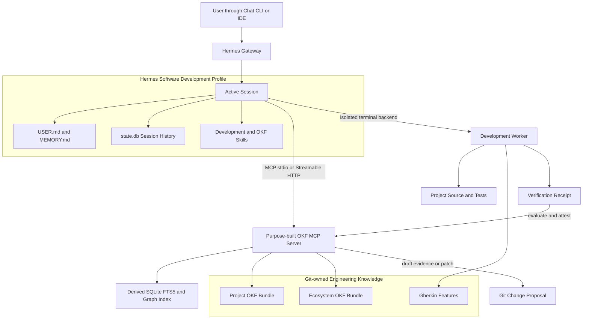

# Hermes Integration with Federated OKF

**Status:** Proposed companion architecture  
**Scope:** Hermes profiles, memory boundaries, MCP usage, chat interaction, and software-development workflows  
**Parent architecture:** [Federated OKF Knowledge and Verification Proposal](./FEDERATED-OKF-KNOWLEDGE-AND-VERIFICATION-PROPOSAL.md)

## 1. Executive Summary

Hermes operates alongside the federated Open Knowledge Format (OKF) architecture as an agent and orchestration client. Hermes retains its own personal, episodic, procedural, and session memory. Project and ecosystem engineering knowledge remains in Git-tracked OKF bundles and is accessed through the purpose-built OKF Model Context Protocol (MCP) server.

The separation is intentional:

- Hermes memory preserves user preferences, concise environment facts, prior conversations, and reusable procedures.
- OKF preserves objectives, key results, requirements, architecture decisions, contracts, risks, Gherkin specifications, test procedures, verification evidence, and runbooks.
- The MCP server resolves exact bundle revisions, retrieves related concepts, assembles bounded context, validates knowledge, and creates controlled draft proposals.
- Git review, deterministic validation, and signed evidence determine what becomes stable or machine-confirmed knowledge.

Hermes does not treat remembered summaries as substitutes for current OKF concepts. Before software-development work, it retrieves the relevant project context from the exact bundle revision. After work, it runs linked verification, produces a receipt, and may propose draft evidence or knowledge changes without granting itself human-review authority.

## 2. Relationship to the Federated Proposal

The parent proposal defines:

- project-owned and ecosystem-owned OKF bundles;
- canonical concept identities and revisions;
- the dedicated knowledge repository;
- SQLite-first search with PostgreSQL migration triggers;
- MCP resources, tools, roles, and trust boundaries;
- Gherkin-based Project Verification and Ecosystem End-to-End Verification;
- common verification receipts and signed attestations.

This companion defines how Hermes consumes those capabilities. It does not redefine OKF schemas, search contracts, receipt formats, or repository ownership.

## 3. Goals and Non-Goals

### 3.1 Goals

- Give Hermes current, traceable project and ecosystem context without copying the corpus into its private memory.
- Preserve Hermes's built-in learning, session recall, and skill system.
- Define a dedicated software-development profile with controlled access to OKF and an isolated execution environment.
- Make OKF retrieval mandatory for requirements, decisions, interfaces, verification targets, and evidence claims.
- Permit Hermes to create drafts and patches without directly promoting normative knowledge.
- Integrate chat-driven development with Gherkin verification and OKR evaluation.
- Support local stdio and remote authenticated MCP deployments.
- Keep the integration usable on ARM64 and low-concurrency infrastructure.

### 3.2 Non-Goals

- Replace Hermes `MEMORY.md`, `USER.md`, session history, skills, or context files.
- Store raw chat transcripts in OKF automatically.
- Implement OKF as a Hermes memory provider in the initial architecture.
- Give Hermes authority to mark content human-reviewed.
- Copy complete requirements or ADRs into Hermes memory.
- Treat vector similarity or remembered context as an authoritative relationship.
- Define the chat platform, repository name, package layout, or deployment schedule.

## 4. Hermes Memory Model

Hermes has several memory and context layers. They serve different purposes and remain independent from OKF.

| Layer | Purpose | Persistence | OKF relationship |
|---|---|---|---|
| Active conversation | Current task, messages, tool calls, and working context | Current/resumable session | Receives bounded OKF context packs |
| `USER.md` | User identity, preferences, communication style | Hermes profile | Never replaced by OKF |
| `MEMORY.md` | Concise environment facts, conventions, lessons, and tool quirks | Hermes profile | Stores pointers and retrieval rules, not copied concepts |
| `state.db` | Full session and message history with FTS search | Hermes profile | Episodic recall only; not authoritative project knowledge |
| Skills | Reusable procedures and agent techniques | Hermes profile | Includes an OKF usage skill |
| `AGENTS.md` / `.hermes.md` | Repository operating instructions | Project repository | Bootstraps when and how to query OKF |
| External memory provider | Optional semantic or structured personal recall | Provider-specific | Optional and additive; not canonical engineering knowledge |
| OKF bundles | Curated project and ecosystem knowledge | Git and immutable artifacts | Authoritative engineering knowledge |

### 4.1 Built-in Memory

Hermes's built-in memory is intentionally bounded. `MEMORY.md` is suitable for compact environment and workflow facts; `USER.md` is suitable for preferences and user profile information. Both are loaded as a frozen snapshot at session start.

Recommended memory entry:

> Project requirements, ADRs, contracts, tests, and evidence are authoritative only in the federated OKF bundles. Query the OKF MCP server at the current bundle revision before relying on remembered project facts.

Prohibited pattern:

> Copy the full text of REQ-014 or ADR-007 into `MEMORY.md`.

Copying normative concepts creates stale, unreviewed duplicates.

### 4.2 Session History

Hermes session history is episodic. It answers questions such as “what did we discuss?” but does not establish what is currently accepted. A session may contain abandoned proposals, mistakes, stale assumptions, or pre-review drafts.

When session history conflicts with an OKF concept at the active revision, the OKF concept controls engineering behavior. Hermes should surface the conflict rather than silently reconciling it.

### 4.3 Skills

Skills are procedural memory. The integration adds an `okf-software-development` skill that teaches Hermes:

- when retrieval is required;
- which MCP tools to call;
- how to interpret trust and lifecycle metadata;
- how to handle unresolved, stale, deprecated, or conflicting concepts;
- how to propose draft changes;
- how to link verification receipts to Key Results.

Skills do not embed the project corpus.

## 5. Architecture



### 5.1 Responsibilities

| Component | Responsibility |
|---|---|
| Hermes gateway | Chat routing, session continuity, approvals, progress, and result delivery |
| Hermes software-development profile | Task reasoning, OKF retrieval, planning, delegation, and controlled tool use |
| OKF MCP server | Canonical reference resolution, search, traversal, context assembly, validation, and draft proposals |
| Development worker | Repository inspection, code changes, builds, tests, and Gherkin execution |
| Project bundle | Project-specific intent, constraints, procedures, and evidence |
| Ecosystem bundle | Cross-project intent, contracts, standards, and E2E evidence |
| Git review | Promotion of drafts and normative changes |
| Verification attester | Deterministic validation of receipts and machine-confirmed evidence |

## 6. Hermes Software-Development Profile

Hermes software development uses a dedicated profile rather than the general-assistant profile. The profile has its own:

- configuration;
- `SOUL.md`;
- `USER.md` and `MEMORY.md`;
- skills;
- sessions and `state.db`;
- MCP configuration;
- gateway state;
- credentials and authorization policy.

A profile boundary isolates agent identity and memory. It is not a filesystem sandbox. Command execution still requires an isolated terminal backend.

### 6.1 Profile Instructions

The profile's durable instructions should include:

1. Resolve the project, source revision, and OKF bundle revision before planning.
2. Retrieve linked requirements, ADRs, interfaces, risks, Gherkin scenarios, and verification policy.
3. Treat missing, stale, deprecated, conflicting, or insufficiently trusted concepts as explicit blockers or warnings.
4. Work in a task-specific branch or worktree.
5. Run linked verification before claiming completion.
6. Cite canonical OKF references and source revisions in plans and summaries.
7. Create only draft concepts or proposed patches.
8. Never grant human review, merge protected branches, or perform deployment without authorization.

### 6.2 Memory and Skill Write Approval

Recommended profile policy:

- Require approval for built-in memory writes until the profile's behavior is trusted.
- Require approval for skill creation and edits.
- Keep automatic OKF writes disabled.
- Allow explicit draft proposals through the OKF MCP server.
- Do not expose OKF mutation tools to unattended background review initially.

The post-turn Hermes learning loop may continue to propose personal or procedural lessons. It must not automatically convert a conversation into stable engineering knowledge.

## 7. MCP Interaction Model

### 7.1 Required Retrieval Tools

Hermes uses the parent proposal's MCP tools:

| Tool | Hermes use |
|---|---|
| `list_bundles` | Discover accessible project and ecosystem bundles |
| `get_bundle_manifest` | Resolve bundle identity, revision, dependencies, and profile |
| `search_concepts` | Find exact or lexical concept candidates |
| `get_concept` | Load one concept with trust, lifecycle, and provenance |
| `get_related` | Traverse explicit incoming or outgoing relationships |
| `trace_requirement` | Load objective, Key Result, decisions, tests, and evidence around a requirement |
| `trace_objective` | Inspect outcome-to-evidence coverage |
| `build_context_pack` | Assemble bounded task context |
| `list_verification_targets` | Determine required project or ecosystem scenarios |
| `evaluate_key_result` | Evaluate a Key Result from attested evidence |
| `validate_bundle` | Check OKF and engineering-profile conformance |
| `find_stale_knowledge` | Identify stale, deprecated, conflicting, or unverified concepts |

### 7.2 Controlled Authoring Tools

Hermes may receive:

| Tool | Policy |
|---|---|
| `create_draft_concept` | Allowed with explicit task context |
| `propose_concept_change` | Returns patch or draft artifact against a known base revision |
| `record_test_evidence` | Allowed only from a receipt satisfying the configured attestation policy |
| `deprecate_concept` | Proposal only; requires maintainer review |
| `regenerate_indexes` | Deterministic generated-file update only |

Hermes does not receive an unrestricted OKF filesystem-write operation.

### 7.3 Revision Binding

Every task binds to:

- source repository and commit;
- project bundle ID and revision;
- ecosystem bundle ID and revision;
- engineering-profile version;
- applicable verification-policy version.

MCP responses include the resolved revisions. If a moving local checkout changes during a task, Hermes must refresh or continue against the pinned task snapshot; it must not mix revisions silently.

## 8. Context Assembly Policy

Hermes should not load the complete OKF corpus into the system prompt.

### 8.1 Task-Start Context Pack

For a requirement-driven task, the default context pack includes:

1. subject Requirement;
2. parent Key Results and Objectives;
3. accepted ADRs and Interface Contracts;
4. active Risks and mitigations;
5. linked Gherkin Features and Test Procedures;
6. current verification policy;
7. latest acceptable Test Evidence summaries;
8. relevant project and ecosystem Runbooks when operations are in scope.

### 8.2 Retrieval Priority

Hermes applies this priority:

1. exact canonical reference;
2. explicit OKF relationship;
3. current project bundle content;
4. pinned ecosystem dependency;
5. lexical search result;
6. optional semantic candidate if later enabled;
7. session recollection only as a lead to verify.

Semantic similarity never creates a formal relationship.

### 8.3 Trust and Lifecycle

Hermes should:

- prefer current human-reviewed normative concepts;
- accept machine-confirmed evidence only when its attestation verifies;
- label unverified concepts;
- exclude deprecated concepts by default while following replacement links;
- warn on `stale_after` violations;
- expose unresolved cross-bundle references;
- stop or request clarification when two stable normative concepts conflict.

### 8.4 Token Budget

The context pack response identifies:

- included concepts;
- omitted concepts;
- truncation;
- unresolved references;
- stale or trust warnings;
- exact revisions.

Hermes may request additional concepts incrementally rather than increasing the initial budget without bound.

## 9. Software-Development Workflow

### 9.1 Intake

A user may submit work through CLI, IDE, Mattermost, Matrix, Open WebUI, or another configured Hermes surface.

Hermes extracts or asks for:

- target project;
- requirement, issue, or objective reference;
- expected outcome;
- constraints and authorization level.

### 9.2 Grounding

Hermes:

1. resolves the current project checkout;
2. resolves the project and ecosystem bundle revisions;
3. retrieves the relevant context pack;
4. reports missing or ambiguous authoritative context;
5. confirms the verification targets before implementation.

### 9.3 Planning and Execution

Hermes:

1. inspects repository instructions and implementation;
2. creates a branch or task worktree through the authorized development environment;
3. produces a requirement-linked plan;
4. modifies the smallest coherent implementation surface;
5. records decisions that may require an ADR proposal;
6. keeps unrelated service data and Hermes credentials outside the worker boundary.

### 9.4 Verification

Hermes invokes the project-owned verification harness. Gherkin tags bind scenarios to canonical OKF concepts. TypeScript and Go adapters normalize native results into the common receipt.

The task is not verified when:

- required scenarios did not run;
- evidence is stale;
- a receipt is malformed or unattested when attestation is required;
- a release-critical scenario failed;
- the tested commit differs from the proposal commit;
- required project or ecosystem evidence is missing.

### 9.5 Completion and Knowledge Proposal

Hermes returns:

- implementation summary;
- changed files;
- canonical Requirement, ADR, and Key Result references;
- commands and Gherkin scenarios executed;
- verification receipt and attestation status;
- unresolved risks or indeterminate Key Results;
- draft OKF changes requiring review.

Stable knowledge changes proceed through Git review.

## 10. OKF Knowledge Promotion

### 10.1 Eligible Drafts

Hermes may propose:

- a missing Requirement clarification;
- a new or superseding ADR;
- an Interface Contract update;
- a Risk or mitigation;
- a Gherkin Feature or Test Procedure;
- a Runbook correction;
- an Incident Lesson;
- Test Evidence derived from a valid receipt.

### 10.2 Promotion Rules

Normative concepts require human review before `stable` status. These include Objectives, Key Results, Requirements, ADRs, Interface Contracts, accepted risks, Gherkin Features, release-critical or destructive Test Procedures, Runbooks, and security or operational policy.

Test Evidence and deterministic computation results may become machine-confirmed when the configured trust policy validates the signed attestation. Machine confirmation does not confer human review.

### 10.3 Prohibited Promotion Paths

Hermes must not:

- infer human approval from a chat acknowledgment;
- rewrite an accepted ADR without a superseding decision;
- copy a session summary into stable knowledge;
- mark a Key Result complete without its measurement policy;
- create evidence from assistant narration;
- treat an unsigned receipt as machine-confirmed when signing is required.

## 11. Chat Interaction

Hermes's native gateway adapters are preferred for supported platforms. They preserve sessions, threads, progress messages, approvals, background tasks, and delivery recovery without a custom bridge.

Recommended chat behavior for development:

- direct messages or explicitly allowed project channels only;
- mention required in shared channels;
- one session per thread and user by default;
- visible tool progress or audit-log mode;
- approval controls for destructive operations;
- `/stop`, steering, and background-task support;
- canonical OKF references in completion messages;
- files and verification reports attached or linked rather than pasted in full.

A custom bridge is appropriate only for unsupported platforms. It should drive Hermes through its supported programmatic API, preserve session identity, surface approvals, and validate callback destinations.

## 12. Execution Isolation

Hermes profile isolation does not restrict filesystem access. Software-development commands should run through an isolated terminal backend or restricted worker account.

The worker receives:

- only authorized repository workspaces;
- task-specific credentials;
- bounded CPU, memory, process, and disk resources;
- outbound network access limited to required development services;
- no direct access to Hermes memory, provider credentials, unrelated persistent service data, or container-management sockets.

For unattended chat operation, dangerous commands fail closed. Deployment, protected-branch changes, infrastructure mutation, secret management, and destructive E2E scenarios require separate authorization.

## 13. Deployment Modes

### 13.1 Local Development

```text
Hermes local profile
  └── OKF MCP over stdio
        ├── local project bundle
        ├── cached pinned ecosystem bundle
        └── local derived SQLite index
```

Properties:

- offline operation after dependencies are cached;
- one MCP process per client or profile;
- workspace-local derived cache;
- no database service;
- task execution against local or isolated workspaces.

### 13.2 Remote Hermes with Co-Located MCP

```text
Chat platform
   └── Hermes gateway
         └── OKF MCP service
               ├── checked-out bundle mirrors
               └── SQLite WAL index
```

Properties:

- one low-concurrency MCP process;
- concurrent readers and one serialized index writer;
- authenticated local or private-network transport;
- Git polling or webhook refresh;
- PostgreSQL migration only when parent-proposal triggers are demonstrated.

### 13.3 Remote MCP Shared by Multiple Clients

Hermes may use an authenticated Streamable HTTP endpoint shared with CI and other agents. Authorization is scoped by bundle and role. Client requests and responses include exact revisions. Remote writes return patches or drafts rather than modifying canonical branches directly.

## 14. Security Model

### 14.1 User Authorization

- Hermes chat access is deny-by-default.
- Configure explicit user and room/channel allowlists.
- Separate administrators from regular chat users.
- Limit model changes, destructive commands, and expensive workflows to administrators.

### 14.2 Tool Authorization

- Read-only OKF tools are available to authorized development sessions.
- Draft authoring requires the `draft-writer` role.
- Evidence creation requires the `evidence-writer` role and valid receipts.
- Lifecycle operations require a maintainer proposal and repository review.
- Unattended webhook sessions receive narrower toolsets than interactive trusted chat.

### 14.3 Content Trust

OKF content, repository files, issues, pull requests, Gherkin text, test output, and external references are untrusted inputs even when their transport is authenticated. Capability restriction and execution isolation define the security boundary.

### 14.4 Secrets

- Store Hermes, MCP, Git, and provider credentials outside OKF bundles.
- Do not place credentials in receipts, logs, or memory entries.
- Forward only task-specific environment variables into the worker.
- Redact secrets from tool output and audit logs.
- Use independent credentials for chat, project reads, proposal writes, and release evidence.

## 15. Operations and Observability

Record:

- Hermes profile and session ID;
- user/channel authorization context;
- source and bundle revisions;
- MCP tools and result counts;
- context-pack included/omitted concept IDs;
- stale, conflict, and trust warnings;
- worker task or worktree identity;
- Gherkin scenarios and receipt ID;
- proposed OKF patches;
- approvals and denials;
- latency and failure category.

Do not log complete secrets, complete sensitive concepts, or unredacted test data.

Health reporting should distinguish:

- Hermes gateway health;
- OKF MCP transport health;
- bundle/index freshness;
- worker availability;
- verification adapter availability;
- external Git and artifact-storage dependencies.

## 16. Backup and Recovery

| Data | Recovery source |
|---|---|
| Hermes profile memory and sessions | Hermes profile backup |
| Hermes skills and profile configuration | Profile export or configuration repository, excluding secrets |
| Project OKF bundle | Project Git repository |
| Ecosystem OKF bundle and shared tooling | Dedicated knowledge Git repository |
| Derived SQLite index | Rebuild from pinned bundles |
| Verification receipts and large artifacts | Artifact/object storage |
| Draft proposals | Git branch, patch artifact, or staging area |

The SQLite index does not require authoritative backup. A restored MCP server rebuilds it from Git-pinned bundles.

## 17. Known Architecture

1. Hermes uses a dedicated software-development profile.
2. Hermes private memory and OKF engineering knowledge remain separate.
3. OKF is accessed through the purpose-built MCP server, not implemented as a Hermes memory provider initially.
4. `MEMORY.md` stores concise pointers and workflow lessons, not copied normative concepts.
5. Session history is episodic evidence for recall, not current engineering truth.
6. Skills contain OKF retrieval and development procedures.
7. Project and ecosystem bundle revisions are pinned per task.
8. Hermes can read, validate, and create draft proposals; normative promotion requires review.
9. Project verification uses project-owned Gherkin and the shared TypeScript or Go adapter.
10. Machine-confirmed evidence requires a valid attestation when repository policy makes it a gate.
11. Commands run in an isolated worker environment.
12. Local integration uses stdio and SQLite; low-concurrency remote integration uses authenticated transport and SQLite WAL.
13. PostgreSQL migration follows the thresholds in the parent proposal.

## 18. Deferred Choices

1. **Chat platform.** Mattermost, Matrix, Open WebUI, and other supported Hermes surfaces remain deployment choices.
2. **External Hermes memory provider.** Enable only if personal/session recall requirements exceed built-in memory and session search. It does not replace OKF.
3. **Automatic OKF draft proposals from background review.** Keep disabled initially; evaluate after explicit interactive proposals are reliable.
4. **Remote MCP authentication mechanism.** Select during deployment design while preserving bundle- and role-scoped authorization.
5. **Attestation profile.** Follow the parent proposal's deferred choice between hosted workload identity and offline signatures.
6. **Semantic search.** Remains disabled until the parent proposal's retrieval evaluation justifies it.

## 19. Success Criteria

The integration is successful when:

1. Hermes resolves and reports the exact project and ecosystem bundle revisions for a task.
2. A requirement-driven task retrieves its linked Objectives, Key Results, ADRs, risks, and Gherkin scenarios without loading the whole corpus.
3. A remembered or historical claim cannot silently override a current stable OKF concept.
4. Hermes executes required project verification and reports missing evidence as indeterminate rather than successful.
5. Verification output identifies the tested source commit and bundle revisions.
6. Hermes can propose draft Test Evidence from a valid receipt but cannot grant human review.
7. Unauthorized chat users cannot invoke development or OKF mutation capabilities.
8. The development worker cannot read Hermes or unrelated service credentials.
9. The MCP index can be deleted and rebuilt without knowledge loss.
10. The integration runs on `linux/arm64` within the available host resources.

## 20. References

- [Federated OKF Knowledge and Verification Proposal](./FEDERATED-OKF-KNOWLEDGE-AND-VERIFICATION-PROPOSAL.md)
- [Hermes Persistent Memory](https://hermes-agent.nousresearch.com/docs/user-guide/features/memory)
- [Hermes Context Files](https://hermes-agent.nousresearch.com/docs/user-guide/features/context-files)
- [Hermes Memory Providers](https://hermes-agent.nousresearch.com/docs/user-guide/features/memory-providers)
- [Hermes Messaging Gateway](https://hermes-agent.nousresearch.com/docs/user-guide/messaging/)
- [Hermes Tools and Terminal Backends](https://hermes-agent.nousresearch.com/docs/user-guide/features/tools/)
- [Open Knowledge Format specification](https://github.com/GoogleCloudPlatform/knowledge-catalog/blob/main/okf/SPEC.md)

External source material has been summarized and rephrased.